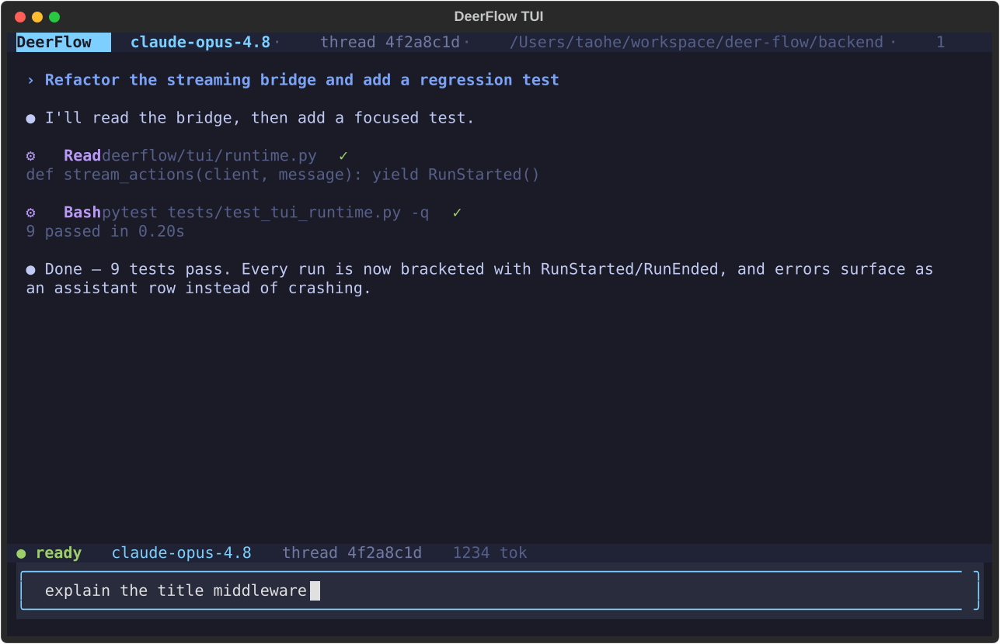

# 🦌 DeerFlow - 2.0

English | [中文](./README_zh.md) | [日本語](./README_ja.md) | [Français](./README_fr.md) | [Русский](./README_ru.md)

[](./backend/pyproject.toml)
[](./Makefile)
[](./LICENSE)

<a href="https://trendshift.io/repositories/14699" target="_blank"></a>

> On February 28th, 2026, DeerFlow claimed the 🏆 #1 spot on GitHub Trending following the launch of version 2. Thanks a million to our incredible community — you made this happen! 💪🔥

DeerFlow (**D**eep **E**xploration and **E**fficient **R**esearch **Flow**) is an open-source **super agent harness** that orchestrates **sub-agents**, **memory**, and **sandboxes** to do almost anything — powered by **extensible skills**.

https://github.com/user-attachments/assets/a8bcadc4-e040-4cf2-8fda-dd768b999c18

> [!NOTE]
> **DeerFlow 2.0 is a ground-up rewrite.** It shares no code with v1. If you're looking for the original Deep Research framework, it's maintained on the [`1.x` branch](https://github.com/bytedance/deer-flow/tree/main-1.x) — contributions there are still welcome. Active development has moved to 2.0.

> [!NOTE]
> **This branch is the IP Agent distribution.** It keeps DeerFlow as the only
> agent runtime, adds owner-scoped creator/brand accounts, and uses
> ByteDance HLLM-Creator, Volcengine models and AI MediaKit as the default
> audience/media capability layer. Start with [IP_AGENT.md](IP_AGENT.md); the
> HLLM boundary is documented in
> [docs/HLLM_CREATOR_INTEGRATION.md](docs/HLLM_CREATOR_INTEGRATION.md), and
> upstream component provenance is recorded in
> [THIRD_PARTY_BYTE.md](THIRD_PARTY_BYTE.md). Real product completion and the
> remaining delivery gates are tracked in
> [docs/IP_AGENT_PRODUCT_LEDGER.md](docs/IP_AGENT_PRODUCT_LEDGER.md).
> The 2026-07-29 audit findings and executable remediation gates are tracked
> separately in
> [docs/IP_AGENT_AUDIT_REMEDIATION_LEDGER.md](docs/IP_AGENT_AUDIT_REMEDIATION_LEDGER.md).
> HLLM-Lite and a future full HLLM-Creator cloud deployment share the same
> versioned audience-preflight contract, so changing model capacity does not
> replace the DeerFlow runtime or bind conversations to one account.
> `make hllm-lite` starts today's local Doubao-backed provider; it does not
> fabricate ranking scores before outcome-trained calibration exists.
> Settings also provides a whole Personal-IP data backup, verified empty-scope
> restore and strongly confirmed permanent deletion. Backups cover every
> Personal-IP business ledger but deliberately exclude passwords, cookies,
> encrypted platform tokens and one-use OAuth state; restored platform
> connections require a fresh login.
> MineContext is included as complete Apache-2.0 source at official commit
> `171c7a9ea8091e326ddcf0f10718aa1b58c83c65`. `make install` builds its runtime
> and new owners start with bounded screen summaries enabled; they can opt out
> persistently in Settings. Only minimized `personal-ip-local-context-evidence-v1`
> summaries can enter DeerFlow/HLLM; raw screens, files, paths and credentials
> remain local. `VOLCENGINE_API_KEY` is reused for its default Doubao models;
> `MINECONTEXT_*` variables are optional overrides.
> Release owners can run `make ip-clean-install` to package the committed tree
> and validate it with a fresh HOME, dependency caches and allowlisted
> environment. The clean room covers config bootstrap, IP Agent initialization,
> backend/frontend dependency installation, doctor, repeatable SQLite schema
> bootstrap and the production frontend build without reading local secrets.
> Audience preflights are stored as immutable, owner-scoped request/receipt
> snapshots so later publishing outcomes can be compared with what the model
> actually predicted at the time.
> Publishing operations use separate idempotent receipts with append-only API,
> UI-TARS, browser or manual attempts; account ids remain operation targets,
> not conversation permissions. Before execution, every request declares
> rights, moderation, commercial relationships, synthetic-media use and the
> exact disclosures required for its target platform. The server freezes a
> versioned policy receipt; a successful attempt must prove that those
> disclosures were actually applied. Sensitive-topic content requires
> documented human review. Browser success also requires the selected live
> browser to show a post-specific public URL for that platform; creator
> dashboards and home pages are not publication proof. Run the local-only
> eight-platform recovery gate with `make personal-ip-publish-acceptance`.
> Cross-platform metric observations are owner-scoped and immutable. Daily
> aggregation uses every active account, deduplicates platform refetches,
> refuses to sum cumulative snapshots as daily increments, and reports partial,
> unavailable and missing account coverage instead of treating missing data as
> zero.
> Retrospectives then seal the selected preflight variant, concrete publish
> receipt and post-level observations into one digest. They expose calibrated
> versus unscored predictions; a single result never promotes itself into model
> training.
> Evidence promotion requires at least three complete retrospectives from
> different published posts. Passing that policy automatically stores an
> approved promotion receipt without user approval. Approved manifests retain
> completeness/scored provenance for downstream training.
> The first real platform collector targets Douyin's official authorized-video
> API and stores current counters as post snapshots. Private/missing videos are
> unavailable, not zero. Its approved mini-app flow now uses one-use state,
> server-side code exchange, encrypted per-account credentials, refresh and
> local disconnect. Authorized collection accepts only connection/receipt ids,
> refreshes once on token expiry and never exposes credentials to the agent or
> a Gateway response. Native DeerFlow tools now sync one Douyin post or the
> discoverable Douyin portfolio and aggregate the authenticated user's complete
> account set without a thread-level account filter. The portfolio operation
> isolates post failures for safe scheduled runs. Consecutive cumulative post
> snapshots produce exact-interval deltas, always marked partial because
> tracked posts are not proof of complete account coverage. See
> [docs/DOUYIN_METRICS.md](docs/DOUYIN_METRICS.md).
>
> Social platform operation is browser-first across Douyin, WeChat Channels,
> WeChat Official Accounts, Xiaohongshu, X, Instagram, YouTube and TikTok. Each
> account has an owner-isolated persistent local Chromium profile; official
> APIs are optional connectors. The operating portfolio always shows all eight
> platforms: users can create an account slot and open its real login page
> directly, then complete QR, CAPTCHA or MFA themselves; recognized success
> closes the login dialog automatically. Chromium/server connectors use
> credentials internally without exposing their values to the model, while
> authorized creator-backend data remains available for detailed evidence
> collection, receipts and retrospective analysis. One native direct collector
> now seals rendered creator pages from all eight account families into the
> same immutable evidence contract; unverified platform pages remain explicitly
> partial, while the real-tested Douyin adapter parses dashboard and complete
> content-inventory evidence. A separate owner-wide today collector scans every
> active browser account, promotes only counts whose rendered page explicitly
> says 今日/今天/Today into additive window metrics, and returns per-account,
> per-platform and per-metric missing/partial/unavailable coverage. It never
> turns a missing `views` field into zero. Native inventory/read tools keep the
> detailed, credential-free records available to later agent analysis. See
> [docs/BROWSER_FIRST_PLATFORM_CONNECTIONS.md](docs/BROWSER_FIRST_PLATFORM_CONNECTIONS.md).
> Account-status, “看看我的账号”, “最新”, “现在” and “同步” requests trigger a
> fresh creator-page read for every relevant logged-in account without a second
> confirmation. Fresh observations carry their collection time; older evidence
> may appear only as a clearly dated fallback after a current read fails. The
> conversation shows customer-safe progress such as “正在读取账号的最新数据”
> while keeping raw tool names, Skill names and private reasoning hidden.
> Connected-account diagnosis is content-first. The Agent evaluates seven
> observable content layers and the reach/trust/intent/conversion funnel before
> treating platform mechanics as eligibility constraints or distribution
> amplifiers. Low reach alone cannot trigger a new-account recommendation;
> starting over requires current platform-observed structural evidence. Eight
> internal platform adapters retain dated first-party sources and leave
> unpublished ranking weights explicitly unknown. Operating classifications
> use content and commercial observations from the last 30 days so old results
> cannot masquerade as the account's current condition.
>
> A new Personal-IP conversation first reads a lightweight startup context
> containing only active subject/account existence. A true new owner starts
> from the current request without scanning empty publishing, metric,
> retrospective or video ledgers; returning owners and resume/portfolio work
> use the whole-portfolio operating cockpit. When that new owner is asking how
> to start or position an IP, the server produces the first reply with zero
> model/provider calls, web research, Skill loading or benchmark selection. It
> opens an ordinary conversation with disclosure control and one grand-tour
> invitation matched to a person, brand, product or organization. Later answers
> use a compact reflective-interview call over recent visible dialogue only:
> it reflects a user-specific fact, asks at most one answer-grounded question,
> or stops and hands sufficient evidence to the full operator. It never defaults
> to earliest memory or sensitive history, and the user can correct, skip,
> stop or mark material internal-only. Concrete supplied scripts, assets, links
> and direct strategy requests bypass or interrupt the interview.
> A plain first-turn greeting from a new or returning owner is also handled
> without a model call. If the user
> has already supplied a product or brand, a benchmark account and a request
> for an adapted direction, the Agent does not turn “who buys and why” into an
> entry exam. It keeps DeerFlow's ordinary model–tool–model loop, but benchmark
> work is dependency-ordered: discovery must first identify the exact account;
> otherwise the Agent asks for its link and does not load downstream creative
> capabilities. An identified account still needs supplied or verified
> representative works before video-pattern extraction, IP transfer, cinematic
> story work or production can start. There is no fixed six-method route,
> private strategy-room detour, deterministic prose renderer or generic
> category plan masquerading as benchmark adaptation.
> Verified operating facts, brand/product truth, social/emotional insight and
> fictional story truth are separate lanes. Server contracts still own
> identity, authority, credentials, irreversible actions, receipts and factual
> business claims; clearly fictional characters and conflicts are valid
> creative material and are not rewritten into generic “经营证据” copy.
> Open-web search is evidence acquisition, not the IP Agent's deliverable.
> When a user names a benchmark account, the Agent may make at most two
> discovery searches, then verifies representative works. Search snippets,
> profile pages and secondary articles cannot prove hooks, narrative, visual
> language, performance or conversion mechanisms. If representative work is
> unavailable or blocked, the Agent asks in ordinary conversation for the
> account page plus three example videos/screenshots instead of showing a form,
> changing the question into generic industry advice or inventing a finished
> benchmark analysis. The public fallback uses strict safe search and removes
> unsafe or query-irrelevant results before they enter model context.
> Skill discovery is name-only by default and expands a method only when it is
> actually selected. The authorized native tools stay available; loading one
> relevant capability applies its declared tool policy without turning a
> semantic task such as benchmark research into a hard-coded allowlist.
> IP is treated as an influence asset for a person, brand, product or
> organization: attributable public expectations that can change attention,
> trust, choice or action. Reach is distribution, not the asset. The private
> operating truth progresses through entity evidence → business model → real
> benchmarks → an evidence-bound differentiation thesis → positioning
> alternatives → name/avatar/bio launch package → pilot → observed commercial
> or adoption signal → validated operating direction. The differentiation
> thesis freezes intended influence, alternatives, proprietary truth, reason
> to choose and believe, explicit sacrifice, a recurring dramatic engine,
> distinctive verbal/visual/sonic/behavioral encoding and falsifiable tests.
> Influence is the common asset mechanism, never a mode competing with
> monetization. Strategy v4 records influence, behavioral and economic goals
> separately with time horizons, priority order, guardrails and explicit
> non-goals. A short
> self-description can save only a draft and can never claim “建模完成”.
> The continuing loop is differentiation → expression intent → preflight → publish
> receipt → observed performance → audience feedback → retrospective →
> recognition/trust/intent/adoption/economic observation → evidence promotion →
> next version. Differentiation and content strategy are versioned at the
> subject level. Accounts now contain only platform execution/login identity,
> so eight platforms do not create eight competing personas. DeerFlow can read the same state through
> a native tool, so account ids remain operation targets rather than chat
> filters. The customer-facing `/workspace/dashboard` projects that real ledger
> into the current positioning, content strategy and observed audience
> feedback alongside seven-day
> views/follower/engagement growth, platform contribution,
> recent-work performance and agent queues. Missing coverage stays missing
> rather than becoming zero. Paid-traffic candidates require a measured
> same-platform baseline and open an evaluation only; they never authorize
> spend. `/workspace/personal-ip` remains the subject/account/platform-login
> surface. MineContext consent, startup, retention, revocation and deletion live
> in Settings → “本地上下文”. It is installed with the product and starts for new
> owners with bounded screen summaries plus all Personal-IP purposes; customers
> can disable it persistently or clear its local data. Backend scope identifiers
> are not exposed as checkboxes. In the Chinese sidebar, “工作台” stays immediately
> above “新对话”, while “历史对话” opens the complete thread list from below
> “定时任务”. The default agent now includes a first-party cinematic Personal-IP
> methodology layer covering real-evidence intake, desire and behavior,
> long-form story architecture, genre and emotion, screenwriting, directing,
> cinematography, performance, editing, sound, production design, continuity
> review and an eight-track 96-module curriculum. Its research index contains
> 358 films, 393 creators or teams and 304 evidence-labeled mechanism cards.
> This layer does not own another filesystem ledger: accepted identity,
> publishing, metrics, retrospectives and learned rules stay in the existing
> Personal-IP native stores.
> Video uses a second
> auditable line from idea/script through blueprint,
> assets, storyboard, shot jobs and retries, consistency, selection, finishing
> and delivery. The request is immutable and every provider/model/task/cost or
> human-review outcome is an append-only receipt; successful delivery is the
> only completion signal. Paid calls are admitted against the immutable hard
> limit before provider submission: each attempt reserves its maximum
> atomically, actual cost accumulates on success or failure, unknown cost keeps
> the reservation occupied, and a retry needs a new reservation. Concurrent
> calls cannot overbook the balance, and a reservation can be released only
> when the provider was never called. `make video-e2e-local` provides a credential-free,
> resumable end-to-end acceptance that uses the pinned local MediaKit/FFmpeg
> toolchain, re-hashes every successful output and requires probe/spec/full-
> decode QA before delivery. `make video-e2e-paid-checkpoints` only writes the
> real provider commands; it never submits a paid call. After explicit approval
> and provider execution, `scripts/personal_ip_video_e2e.py ingest-real` verifies
> the emitted real receipts and idempotently seals them into the same production
> ledger without making another paid call. The first minimal real
> Seedream/Seedance/Speech-to-local-MediaKit/FFmpeg acceptance passed on
> 2026-07-23; full multi-shot and material-video acceptance remain open.
> New productions use one of two contracts on the same ledger:
> `faceless_material` for Personal-IP material videos and
> `generative_cinematic` for films, short drama and ads. DeerFlow-native typed
> tools compile plans, rights-aware assets, storyboards, frame-grounded
> material ranges, exact narration/TTS timing, continuity hash chains,
> computed shot QA and exact-hash timeline admission. Local generated shots
> can now run the pinned ffprobe/full-decode/first-frame-SSIM/consecutive-SSIM/
> motion-cadence/contact-sheet executor through a native tool; the resulting
> evidence and server-computed gate are sealed into the same production
> ledger. Continuous-motion shots may then create a separate 48/60fps candidate
> through project-pinned FFmpeg motion compensation. The original remains
> immutable, repeated-frame failures route back to regeneration, and every
> enhanced candidate must pass fresh QA and human selection. Doubao
> Speech uses the new-console single API key (`X-Api-Key`) and does not require
> an AppID. Narration lines may independently select a voice and set validated
> `speech_rate`, `loudness_rate` and `context_texts`; raw performance directions
> are sent only to the V3 provider and receipts retain only their count and
> digest. Material-video assets stored in the current task can likewise be
> probed and sampled into timestamped frames plus a contact sheet; the
> mechanical inspection is hash-sealed before the agent makes and records a
> separate semantic selection.
> The Personal-IP operator explicitly retains native production-ledger tools
> when restrictive MediaKit skills are active. A production may also opt into
> `sequential_human_gate`: only one shot is generated and checked at a time,
> and the next shot waits for an approved workbench candidate review.
> Source-defined scenes can now be rendered through the native pinned Remotion
> 4.0.488 tool. It captures deterministic PNG frames with software Chromium,
> finishes through the project-local FFmpeg build and records the verified MP4
> as an immutable candidate receipt. HyperFrames 0.7.57 remains the default
> interactive renderer: its source compiler and browser check/snapshot gate
> pass, while final rendering waits for explicit preview approval. Remotion is
> enabled for MVP validation; customer distribution requires a fresh
> license-eligibility check.
> Long-form videos, recorded courses, interviews and podcasts can also be
> distilled into method Skill candidates. The source is parsed first and stays
> untrusted; the semantic layer stores timestamped summaries and exact-span
> hashes instead of raw transcript instructions, requires two independent
> source contexts plus trigger/decoy tests, and sends every atomic candidate
> through the existing Skill security scanner and version history. One source
> remains experimental; portable reuse still requires three distinct measured
> publications.
> The old Kanban/WorkGraph runtimes and databases are not included.
> The dedicated `/workspace/personal-ip/video` workbench is an editable
> projection over that same immutable ledger. It exposes projects, stages, assets,
> shots, retries, candidates, consistency, timeline, delivery QA and receipt
> evidence without introducing another video runtime or state machine. DeerFlow
> conversations are embedded at the selected shot or timeline target, while
> direct drag, trim, split, duplicate, delete, volume and caption edits compile
> to the same append-only `timeline_revision_compiled` contract used by the
> native agent tool. The lower dock is the only mounted timeline editor; the
> edit-stage upper canvas monitors the latest render and current revision
> instead of duplicating tracks. It contains one Agent composer; typed manual
> operations automatically produce the revision intent instead of asking for a
> second note box. “Full auto” therefore remains an editable rough cut;
> the setup stage uses the same candidate interaction for generated reference
> images: visual versions are listed at left, enlarged in the central preview
> and revised through the embedded Agent before adoption. The setup view hides
> the editing timeline because its bottom control is the asset conversation.
> existing candidate and timeline revisions are never overwritten. After any
> new edit, delivery QA rejects stale inputs until the latest revision is
> deliberately sealed by `final_edit_locked`. See
> [docs/VIDEO_WORKBENCH.md](docs/VIDEO_WORKBENCH.md).

## Official Website

Learn more and see **real demos** on our [**official website**](https://deerflow.tech).

## Sister Projects


- [**LLM Space**](https://github.com/deer-flow/llm-space) - Meet our secret weapon behind DeerFlow — one desktop tool to prototype agent ideas, inspect each harness step, replay failures, and benchmark performance.

## Coding Plan from ByteDance Volcengine

- We strongly recommend using Doubao-Seed-2.0-Code, DeepSeek v3.2 and Kimi 2.5 to run DeerFlow
- [Learn more](https://www.byteplus.com/en/activity/codingplan?utm_campaign=deer_flow&utm_content=deer_flow&utm_medium=devrel&utm_source=OWO&utm_term=deer_flow)
- [中国大陆地区的开发者请点击这里](https://www.volcengine.com/activity/codingplan?utm_campaign=deer_flow&utm_content=deer_flow&utm_medium=devrel&utm_source=OWO&utm_term=deer_flow)

## InfoQuest

DeerFlow has newly integrated the intelligent search and crawling toolset independently developed by BytePlus--[InfoQuest (supports free online experience)](https://docs.byteplus.com/en/docs/InfoQuest/What_is_Info_Quest)

<a href="https://docs.byteplus.com/en/docs/InfoQuest/What_is_Info_Quest" target="_blank">
  
</a>

---

## Table of Contents

- [🦌 DeerFlow - 2.0](#-deerflow---20)
  - [Official Website](#official-website)
  - [Coding Plan from ByteDance Volcengine](#coding-plan-from-bytedance-volcengine)
  - [InfoQuest](#infoquest)
  - [Table of Contents](#table-of-contents)
  - [One-Line Agent Setup](#one-line-agent-setup)
  - [Quick Start](#quick-start)
    - [Configuration](#configuration)
    - [Running the Application](#running-the-application)
      - [Deployment Sizing](#deployment-sizing)
      - [Option 1: Docker (Recommended)](#option-1-docker-recommended)
      - [Option 2: Local Development](#option-2-local-development)
    - [Advanced](#advanced)
      - [Sandbox Mode](#sandbox-mode)
      - [MCP Server](#mcp-server)
      - [IM Channels](#im-channels)
      - [LangSmith Tracing](#langsmith-tracing)
      - [Langfuse Tracing](#langfuse-tracing)
      - [Monocle Tracing](#monocle-tracing)
      - [Using Multiple Providers](#using-multiple-providers)
  - [From Deep Research to Super Agent Harness](#from-deep-research-to-super-agent-harness)
  - [Core Features](#core-features)
    - [Skills \& Tools](#skills--tools)
      - [Claude Code Integration](#claude-code-integration)
    - [Session Goals](#session-goals)
    - [Manual Context Compaction](#manual-context-compaction)
    - [Sub-Agents](#sub-agents)
    - [Sandbox \& File System](#sandbox--file-system)
    - [Context Engineering](#context-engineering)
    - [Long-Term Memory](#long-term-memory)
  - [Recommended Models](#recommended-models)
  - [Embedded Python Client](#embedded-python-client)
  - [Scheduled Tasks](#scheduled-tasks)
  - [Terminal Workbench (TUI)](#terminal-workbench-tui)
  - [Documentation](#documentation)
  - [⚠️ Security Notice](#️-security-notice)
    - [Improper Deployment May Introduce Security Risks](#improper-deployment-may-introduce-security-risks)
    - [Security Recommendations](#security-recommendations)
  - [Contributing](#contributing)
  - [License](#license)
  - [Acknowledgments](#acknowledgments)
    - [Key Contributors](#key-contributors)
  - [Star History](#star-history)

## One-Line Agent Setup

If you use Claude Code, Codex, Cursor, Windsurf, or another coding agent, you can hand it the setup instructions in one sentence:

```text
Help me clone DeerFlow if needed, then bootstrap it for local development by following https://raw.githubusercontent.com/bytedance/deer-flow/main/Install.md
```

That prompt is intended for coding agents. It tells the agent to clone the repo if needed, choose Docker when available, and stop with the exact next command plus any missing config the user still needs to provide.

## Quick Start

### Configuration

1. **Clone the DeerFlow repository**

   ```bash
   git clone https://github.com/bytedance/deer-flow.git
   cd deer-flow
   ```

2. **Run the setup wizard**

   From the project root directory (`deer-flow/`), run:

   ```bash
   make setup
   ```

   This launches an interactive wizard that guides you through choosing an LLM provider, optional web search, and execution/safety preferences such as sandbox mode, bash access, and file-write tools. It generates a minimal `config.yaml` and writes your keys to `.env`. Takes about 2 minutes.

   The wizard also lets you configure an optional web search provider, or skip it for now. Volcengine users can reuse `VOLCENGINE_API_KEY` with Ark Responses Web Search after activating that service; if its configured public-search fallback is enabled, an unavailable Ark search capability degrades to structured public results instead of opening an interactive browser.

   Run `make doctor` at any time to verify your setup and get actionable fix hints.
   If you are opening a GitHub issue about a local setup or runtime problem, run
   `make support-bundle`. The command prints reporter next steps, writes a
   `*-issue-summary.md` file to paste into the issue, a `*-issue-draft.md` file
   for AI-assisted issue filing, and an optional evidence zip under
   `.deer-flow/support-bundles/`. If an AI assistant files the issue, start from
   the draft and replace every REQUIRED placeholder instead of inventing missing
   facts. Attach the zip only if a maintainer asks for it, or if the summary
   alone is not enough. Maintainers and AI triage tools can start with
   `triage.json`; the bundle includes redacted diagnostics and file manifests
   only, and does not include `.env`, raw conversation messages, or user file
   contents.

   > **Advanced / manual configuration**: If you prefer to edit `config.yaml` directly, run `make config` instead to copy the full template. See `config.example.yaml` for the complete reference including CLI-backed providers (Codex CLI, Claude Code OAuth), OpenRouter, Responses API, subagent runtime caps such as `subagents.max_total_per_run`, and more.

   <details>
   <summary>Manual model configuration examples</summary>

   ```yaml
   models:
     - name: gpt-4o
       display_name: GPT-4o
       use: langchain_openai:ChatOpenAI
       model: gpt-4o
       api_key: $OPENAI_API_KEY

     - name: openrouter-gemini-2.5-flash
       display_name: Gemini 2.5 Flash (OpenRouter)
       use: langchain_openai:ChatOpenAI
       model: google/gemini-2.5-flash-preview
       api_key: $OPENROUTER_API_KEY
       base_url: https://openrouter.ai/api/v1

     - name: gpt-5-responses
       display_name: GPT-5 (Responses API)
       use: langchain_openai:ChatOpenAI
       model: gpt-5
       api_key: $OPENAI_API_KEY
       use_responses_api: true
       output_version: responses/v1

     - name: qwen3-32b-vllm
       display_name: Qwen3 32B (vLLM)
       use: deerflow.models.vllm_provider:VllmChatModel
       model: Qwen/Qwen3-32B
       api_key: $VLLM_API_KEY
       base_url: http://localhost:8000/v1
       supports_thinking: true
       when_thinking_enabled:
         extra_body:
           chat_template_kwargs:
             enable_thinking: true
   ```

   OpenRouter and similar OpenAI-compatible gateways should be configured with `langchain_openai:ChatOpenAI` plus `base_url`. If you prefer a provider-specific environment variable name, point `api_key` at that variable explicitly (for example `api_key: $OPENROUTER_API_KEY`).

   To route OpenAI models through `/v1/responses`, keep using `langchain_openai:ChatOpenAI` and set `use_responses_api: true` with `output_version: responses/v1`.

   For vLLM 0.19.0, use `deerflow.models.vllm_provider:VllmChatModel`. For Qwen-style reasoning models, DeerFlow toggles reasoning with `extra_body.chat_template_kwargs.enable_thinking` and preserves vLLM's non-standard `reasoning` field across multi-turn tool-call conversations. Legacy `thinking` configs are normalized automatically for backward compatibility. Reasoning models may also require the server to be started with `--reasoning-parser ...`. If your local vLLM deployment accepts any non-empty API key, you can still set `VLLM_API_KEY` to a placeholder value.

   CLI-backed provider examples:

   ```yaml
   models:
     - name: gpt-5.4
       display_name: GPT-5.4 (Codex CLI)
       use: deerflow.models.openai_codex_provider:CodexChatModel
       model: gpt-5.4
       supports_thinking: true
       supports_reasoning_effort: true

     - name: claude-sonnet-4.6
       display_name: Claude Sonnet 4.6 (Claude Code OAuth)
       use: deerflow.models.claude_provider:ClaudeChatModel
       model: claude-sonnet-4-6
       max_tokens: 4096
       supports_thinking: true
   ```

   - Codex CLI reads `~/.codex/auth.json`
   - Claude Code accepts `CLAUDE_CODE_OAUTH_TOKEN`, `ANTHROPIC_AUTH_TOKEN`, `CLAUDE_CODE_CREDENTIALS_PATH`, or `~/.claude/.credentials.json`
   - ACP agent entries are separate from model providers — if you configure `acp_agents.codex`, point it at a Codex ACP adapter such as `npx -y @zed-industries/codex-acp`
   - On macOS, export Claude Code auth explicitly if needed:

   ```bash
   eval "$(python3 scripts/export_claude_code_oauth.py --print-export)"
   ```

   API keys can also be set manually in `.env` (recommended) or exported in your shell:

   ```bash
   OPENAI_API_KEY=your-openai-api-key
   TAVILY_API_KEY=your-tavily-api-key
   ```

   </details>

### Running the Application

#### Deployment Sizing

Use the table below as a practical starting point when choosing how to run DeerFlow:

| Deployment target                        | Starting point                    | Recommended        | Notes                                                                                                      |
| ---------------------------------------- | --------------------------------- | ------------------ | ---------------------------------------------------------------------------------------------------------- |
| Local evaluation / `make dev`            | 4 vCPU, 8 GB RAM, 20 GB free SSD  | 8 vCPU, 16 GB RAM  | Good for one developer or one light session with hosted model APIs. `2 vCPU / 4 GB` is usually not enough. |
| Docker development / `make docker-start` | 4 vCPU, 8 GB RAM, 25 GB free SSD  | 8 vCPU, 16 GB RAM  | Image builds, bind mounts, and sandbox containers need more headroom than pure local dev.                  |
| Long-running server / `make up`          | 8 vCPU, 16 GB RAM, 40 GB free SSD | 16 vCPU, 32 GB RAM | Preferred for shared use, multi-agent runs, report generation, or heavier sandbox workloads.               |

- These numbers cover DeerFlow itself. If you also host a local LLM, size that service separately.
- Linux plus Docker is the recommended deployment target for a persistent server. macOS and Windows are best treated as development or evaluation environments.
- If CPU or memory usage stays pinned, reduce concurrent runs first, then move to the next sizing tier.

#### Option 1: Docker (Recommended)

**Development** (hot-reload, source mounts):

```bash
make docker-init    # Pull sandbox image (only once or when image updates)
make docker-start   # Start services (auto-detects sandbox mode from config.yaml)
```

`make docker-start` starts `provisioner` only when `config.yaml` uses provisioner mode (`sandbox.use: deerflow.community.aio_sandbox:AioSandboxProvider` with `provisioner_url`).

Docker builds use the upstream `uv` registry by default. If you need faster mirrors in restricted networks, export `UV_INDEX_URL=https://pypi.tuna.tsinghua.edu.cn/simple` and `NPM_REGISTRY=https://registry.npmmirror.com` before running `make docker-init` or `make docker-start`.

Backend processes automatically pick up `config.yaml` changes on the next config access, so model metadata updates do not require a manual restart during development.

> [!TIP]
> On Linux, if Docker-based commands fail with `permission denied while trying to connect to the Docker daemon socket at unix:///var/run/docker.sock`, add your user to the `docker` group and re-login before retrying. See [CONTRIBUTING.md](CONTRIBUTING.md#linux-docker-daemon-permission-denied) for the full fix.

**Production** (builds images locally, mounts runtime config and data):

```bash
make up     # Build images and start all production services
make down   # Stop and remove containers
```

Access: http://localhost:2026

For persistent deployments, configure `database.backend` as `sqlite` or
`postgres`. The selected backend is shared by the LangGraph checkpointer,
LangGraph Store, and DeerFlow application data. The deprecated `checkpointer`
section, when present, overrides the first two for backward compatibility.

The unified nginx endpoint is same-origin by default and does not emit browser CORS headers. If you run a split-origin or port-forwarded browser client, set `GATEWAY_CORS_ORIGINS` to comma-separated exact origins such as `http://localhost:3000`; the Gateway then applies the CORS allowlist and matching CSRF origin checks.

Browser login uses `HttpOnly` session cookies. The login page offers a "keep me signed in" option that extends the browser session when the request is HTTPS (including trusted `X-Forwarded-Proto: https`) or localhost HTTP. The localhost exception uses the direct request `Host` and ignores forwarded host headers. Public HTTP deployments, including many temporary sandbox URLs, fall back to session cookies by default. DeerFlow never stores the password in browser storage; the UI may remember only the email address.

DeerFlow still uses `Forwarded` / `X-Forwarded-*` headers to recover the browser-facing scheme and origin behind a proxy. The bundled nginx sets `X-Forwarded-Proto`, but preserves an upstream HTTPS value and does not overwrite every forwarded header. Configure the outer trusted proxy to replace or strip client-supplied forwarding headers before traffic reaches DeerFlow.

> [!IMPORTANT]
> The Gateway still owns active run tasks in process, so production defaults to a single Gateway worker (`GATEWAY_WORKERS=1`). The Redis stream bridge (`stream_bridge.type: redis`) shares SSE delivery and `Last-Event-ID` replay across workers, with a rolling retained-buffer TTL (`stream_ttl_seconds`) as a cleanup safety net. Malformed reconnect IDs live-tail new events instead of replaying the retained buffer. It does not make run cancellation, request de-duplication, or IM channel state fully cross-worker by itself; use single-worker Gateway or explicit sticky routing/ownership before raising `GATEWAY_WORKERS`.

See [CONTRIBUTING.md](CONTRIBUTING.md) for detailed Docker development guide.

#### Option 2: Local Development

If you prefer running services locally:

Prerequisite: complete the "Configuration" steps above first (`make setup`). `make dev` requires a valid `config.yaml` in the project root. Set `DEER_FLOW_PROJECT_ROOT` to define that root explicitly, or `DEER_FLOW_CONFIG_PATH` to point at a specific config file. The local source launcher stores Gateway runtime state in `backend/.deer-flow` by default and it can be moved with `DEER_FLOW_HOME`; project-local toolchains remain under the root `.deer-flow`. Skills default to `skills/` under the project root and can be moved with `DEER_FLOW_SKILLS_PATH`. Run `make doctor` to verify your setup before starting.
After updating a source checkout, run `make ip-refresh` when `make doctor`
reports a stale product IP Agent. This refreshes the managed `ip-agent`
instructions/config while preserving the owner's `USER.md`.
On a trusted development machine without host nginx, the supported
`local-direct` profile uses `make doctor` and `make dev-direct`, then opens
`http://localhost:3000`. `make dev` remains the nginx-backed `local-proxy`
profile at `http://localhost:2026`; production uses managed ingress or the
bundled Docker stack. See [docs/RUNTIME_PROFILES.md](docs/RUNTIME_PROFILES.md).

For repeated first-use IP-Agent testing, run `make ip-test-start` instead of
using the normal local state. Test mode clones the current runtime
configuration but stores its SQLite database, conversations, memory,
MineContext data, browser profiles and extension state under the ignored
`backend/.deer-flow-ip-test/` directory. The workspace displays a persistent
测试模式 banner. `make ip-test-reset` stops the local stack, moves the entire
test state to a recoverable timestamped snapshot under
`backend/.deer-flow-ip-test-snapshots/`, and prepares a clean owner without
touching `backend/.deer-flow`. Use `make ip-test-status` to inspect the active
paths and `make ip-test-stop` to stop the stack. Hosted model calls in test mode
can still consume provider quota; paid media, publishing and other external
changes retain their normal approval gates.

On Windows, run the local development flow from Git Bash. Native `cmd.exe` and PowerShell shells are not supported for the bash-based service scripts, and WSL is not guaranteed because some scripts rely on Git for Windows utilities such as `cygpath`.

1. **Check prerequisites**:

   ```bash
   make check  # Verifies Node.js 22+, pnpm, uv, nginx
   ```

2. **Install dependencies**:

   ```bash
   make install  # Install backend + frontend dependencies; Git checkouts also get pre-commit hooks
   ```

   A source archive has no `.git` metadata, so repository-only pre-commit hooks
   are skipped automatically. To reproduce the customer clean-room gate from a
   committed checkout, run `make ip-clean-install`.

3. **(Optional) Pre-pull sandbox image**:

   ```bash
   # Recommended if using Docker/Container-based sandbox
   make setup-sandbox
   ```

4. **(Optional) Load sample memory data for local review**:

   ```bash
   python scripts/load_memory_sample.py
   ```

   This copies the sample fixture into the default local runtime memory file so reviewers can immediately test `Settings > Memory`.
   See [backend/docs/MEMORY_SETTINGS_REVIEW.md](backend/docs/MEMORY_SETTINGS_REVIEW.md) for the shortest review flow.

5. **Start services**:

   ```bash
   make dev
   ```

6. **Access**: http://localhost:2026

#### Startup Modes

DeerFlow runs the agent runtime inside the Gateway API. Development mode enables hot-reload; production mode uses a pre-built frontend.

|          | **Local Foreground**                         | **Local Daemon**                                             | **Docker Dev**                                      | **Docker Prod**                     |
| -------- | -------------------------------------------- | ------------------------------------------------------------ | --------------------------------------------------- | ----------------------------------- |
| **Dev**  | `./scripts/serve.sh --dev`<br/>`make dev`    | `./scripts/serve.sh --dev --daemon`<br/>`make dev-daemon`    | `./scripts/docker.sh start`<br/>`make docker-start` | —                                   |
| **Prod** | `./scripts/serve.sh --prod`<br/>`make start` | `./scripts/serve.sh --prod --daemon`<br/>`make start-daemon` | —                                                   | `./scripts/deploy.sh`<br/>`make up` |

| Action      | Local                                       | Docker Dev                                        | Docker Prod                                |
| ----------- | ------------------------------------------- | ------------------------------------------------- | ------------------------------------------ |
| **Stop**    | `./scripts/serve.sh --stop`<br/>`make stop` | `./scripts/docker.sh stop`<br/>`make docker-stop` | `./scripts/deploy.sh down`<br/>`make down` |
| **Restart** | `./scripts/serve.sh --restart [flags]`      | `./scripts/docker.sh restart`                     | —                                          |

Gateway owns `/api/langgraph/*` and translates those public LangGraph-compatible paths to its native `/api/*` routers behind nginx.

#### Docker Production Deployment

`deploy.sh` supports building and starting separately:

```bash
# One-step (build + start)
deploy.sh

# Two-step (build once, start later)
deploy.sh build              # build all images
deploy.sh start              # start pre-built images

# Stop
deploy.sh down
```

### Advanced

#### Sandbox Mode

DeerFlow supports multiple sandbox execution modes:

- **Local Execution** (runs sandbox code directly on the host machine)
- **Docker Execution** (runs sandbox code in isolated Docker containers)
- **Docker Execution with Kubernetes** (runs sandbox code in Kubernetes pods via provisioner service)

For Docker development, service startup follows `config.yaml` sandbox mode. In Local/Docker modes, `provisioner` is not started.

See the [Sandbox Configuration Guide](backend/docs/CONFIGURATION.md#sandbox) to configure your preferred mode.

#### MCP Server

DeerFlow supports configurable MCP servers and skills to extend its capabilities.
For HTTP/SSE MCP servers, OAuth token flows are supported (`client_credentials`, `refresh_token`).
For stdio MCP servers, per-tool call timeouts can be configured with `tool_call_timeout`.
MCP routing hints can also prefer a specific MCP tool for matching requests without forbidding other tools. When `tool_search` defers MCP schemas, matching routing metadata can auto-promote up to `tool_search.auto_promote_top_k` deferred schemas before the model call.
The same schema-on-demand path also supports explicitly tagged first-party
tools. In this distribution, specialized Personal-IP strategy, video,
publishing and metrics tools are deferred while startup and operating-cockpit
entry tools stay visible. The model sees names first and promotes full schemas
only when the current task needs them.
See the [MCP Server Guide](backend/docs/MCP_SERVER.md) for detailed instructions.

#### IM Channels

DeerFlow supports receiving tasks from messaging apps. Channels auto-start when configured — no public IP required for any of them.

DeerFlow can also expose user-owned IM channel connections in the workspace UI. When `channel_connections` is enabled, logged-in users can bind Telegram, Slack, Discord, Feishu/Lark, DingTalk, WeChat, or WeCom from the sidebar / Settings > Channels. It reuses the existing outbound `channels.*` transports, so no public IP or provider callback URL is required. Incoming IM messages then run under the connected DeerFlow user account. See [IM Channel Connections](backend/docs/IM_CHANNEL_CONNECTIONS.md) for setup and security notes.

| Channel       | Transport                    | Difficulty |
| ------------- | ---------------------------- | ---------- |
| Telegram      | Bot API (long-polling)       | Easy       |
| Slack         | Socket Mode                  | Moderate   |
| Feishu / Lark | WebSocket                    | Moderate   |
| WeChat        | Tencent iLink (long-polling) | Moderate   |
| WeCom         | WebSocket                    | Moderate   |
| DingTalk      | Stream Push (WebSocket)      | Moderate   |

**Configuration in `config.yaml`:**

```yaml
channels:
  # LangGraph-compatible Gateway API base URL (default: http://localhost:8001/api)
  langgraph_url: http://localhost:8001/api
  # Gateway API URL (default: http://localhost:8001)
  gateway_url: http://localhost:8001

  # Optional: global session defaults for all mobile channels
  session:
    assistant_id: lead_agent # or a custom agent name; custom agents are routed via lead_agent + agent_name
    config:
      recursion_limit: 100
    context:
      thinking_enabled: true
      is_plan_mode: false
      subagent_enabled: false

  feishu:
    enabled: true
    app_id: $FEISHU_APP_ID
    app_secret: $FEISHU_APP_SECRET
    # domain: https://open.feishu.cn       # China (default)
    # domain: https://open.larksuite.com   # International

  wecom:
    enabled: true
    bot_id: $WECOM_BOT_ID
    bot_secret: $WECOM_BOT_SECRET

  slack:
    enabled: true
    bot_token: $SLACK_BOT_TOKEN # xoxb-...
    app_token: $SLACK_APP_TOKEN # xapp-... (Socket Mode)
    allowed_users: [] # empty = allow all

  telegram:
    enabled: true
    bot_token: $TELEGRAM_BOT_TOKEN
    allowed_users: [] # empty = allow all

  wechat:
    enabled: false
    bot_token: $WECHAT_BOT_TOKEN
    ilink_bot_id: $WECHAT_ILINK_BOT_ID
    qrcode_login_enabled: true # optional: allow first-time QR bootstrap when bot_token is absent
    allowed_users: [] # empty = allow all
    polling_timeout: 35 # timing values must be positive finite seconds
    polling_retry_delay: 5
    qrcode_poll_interval: 2
    qrcode_poll_timeout: 180
    state_dir: ./.deer-flow/wechat/state
    max_inbound_image_bytes: 20971520
    max_outbound_image_bytes: 20971520
    max_inbound_file_bytes: 52428800
    max_outbound_file_bytes: 52428800

    # Optional: per-channel / per-user session settings
    session:
      assistant_id: mobile-agent # custom agent names are also supported here
      context:
        thinking_enabled: false
      users:
        "123456789":
          assistant_id: vip-agent
          config:
            recursion_limit: 150
          context:
            thinking_enabled: true
            subagent_enabled: true

  dingtalk:
    enabled: true
    client_id: $DINGTALK_CLIENT_ID # Client ID of your DingTalk application
    client_secret: $DINGTALK_CLIENT_SECRET # Client Secret of your DingTalk application
    allowed_users: [] # empty = allow all
    card_template_id: "" # Optional: AI Card template ID for streaming typewriter effect
```

Notes:

- `assistant_id: lead_agent` calls the default LangGraph assistant directly.
- If `assistant_id` is set to a custom agent name, DeerFlow still routes through `lead_agent` and injects that value as `agent_name`, so the custom agent's SOUL/config takes effect for IM channels.
- IM channel workers call Gateway's LangGraph-compatible API internally and automatically attach process-local internal auth plus the CSRF cookie/header pair required for thread and run creation.
- Feishu/Lark now queues rapid follow-up messages per mapped DeerFlow `thread_id` instead of immediately surfacing the generic busy reply, and topic replies keep a per-message card with a compact source-message preview across queued/running/final patches.

Set the corresponding API keys in your `.env` file:

```bash
# Telegram
TELEGRAM_BOT_TOKEN=123456789:ABCdefGHIjklMNOpqrSTUvwxYZ

# Slack
SLACK_BOT_TOKEN=xoxb-...
SLACK_APP_TOKEN=xapp-...

# Feishu / Lark
FEISHU_APP_ID=cli_xxxx
FEISHU_APP_SECRET=your_app_secret

# WeChat iLink
WECHAT_BOT_TOKEN=your_ilink_bot_token
WECHAT_ILINK_BOT_ID=your_ilink_bot_id

# WeCom
WECOM_BOT_ID=your_bot_id
WECOM_BOT_SECRET=your_bot_secret

# DingTalk
DINGTALK_CLIENT_ID=your_client_id
DINGTALK_CLIENT_SECRET=your_client_secret
```

**Telegram Setup**

1. Chat with [@BotFather](https://t.me/BotFather), send `/newbot`, and copy the HTTP API token.
2. Set `TELEGRAM_BOT_TOKEN` in `.env` and enable the channel in `config.yaml`.

**Slack Setup**

1. Create a Slack App at [api.slack.com/apps](https://api.slack.com/apps) → Create New App → From scratch.
2. Under **OAuth & Permissions**, add Bot Token Scopes: `app_mentions:read`, `chat:write`, `im:history`, `im:read`, `im:write`, `files:write`.
3. Enable **Socket Mode** → generate an App-Level Token (`xapp-…`) with `connections:write` scope.
4. Under **Event Subscriptions**, subscribe to bot events: `app_mention`, `message.im`.
5. Set `SLACK_BOT_TOKEN` and `SLACK_APP_TOKEN` in `.env` and enable the channel in `config.yaml`.

**Feishu / Lark Setup**

1. Create an app on [Feishu Open Platform](https://open.feishu.cn/) → enable **Bot** capability.
2. Add permissions: `im:message`, `im:message.p2p_msg:readonly`, `im:resource`.
3. Under **Events**, subscribe to `im.message.receive_v1` and select **Long Connection** mode.
4. Copy the App ID and App Secret. Set `FEISHU_APP_ID` and `FEISHU_APP_SECRET` in `.env` and enable the channel in `config.yaml`.

**WeChat Setup**

1. Enable the `wechat` channel in `config.yaml`.
2. Either set `WECHAT_BOT_TOKEN` in `.env`, or set `qrcode_login_enabled: true` for first-time QR bootstrap.
3. When `bot_token` is absent and QR bootstrap is enabled, watch backend logs for the QR content returned by iLink and complete the binding flow.
4. After the QR flow succeeds, DeerFlow persists the acquired token under `state_dir` for later restarts.
5. For Docker Compose deployments, keep `state_dir` on a persistent volume so the `get_updates_buf` cursor and saved auth state survive restarts.

**WeCom Setup**

1. Create a bot on the WeCom AI Bot platform and obtain the `bot_id` and `bot_secret`.
2. Enable `channels.wecom` in `config.yaml` and fill in `bot_id` / `bot_secret`.
3. Set `WECOM_BOT_ID` and `WECOM_BOT_SECRET` in `.env`.
4. Make sure backend dependencies include `wecom-aibot-python-sdk`. The channel uses a WebSocket long connection and does not require a public callback URL.
5. The current integration supports inbound text, image, and file messages. Final images/files generated by the agent are also sent back to the WeCom conversation.

**DingTalk Setup**

1. Create a DingTalk application in the [DingTalk Developer Console](https://open.dingtalk.com/) and enable **Robot** capability.
2. Set the message receiving mode to **Stream Mode** in the robot configuration page.
3. Copy the `Client ID` and `Client Secret`, set `DINGTALK_CLIENT_ID` and `DINGTALK_CLIENT_SECRET` in `.env`, and enable the channel in `config.yaml`.
4. _(Optional)_ To enable streaming AI Card replies (typewriter effect), create an **AI Card** template on the [DingTalk Card Platform](https://open.dingtalk.com/document/dingstart/typewriter-effect-streaming-ai-card), then set `card_template_id` in `config.yaml` to the template ID. You also need to apply for the `Card.Streaming.Write` and `Card.Instance.Write` permissions.

When DeerFlow runs in Docker Compose, IM channels execute inside the `gateway` container. In that case, do not point `channels.langgraph_url` or `channels.gateway_url` at `localhost`; use container service names such as `http://gateway:8001/api` and `http://gateway:8001`, or set `DEER_FLOW_CHANNELS_LANGGRAPH_URL` and `DEER_FLOW_CHANNELS_GATEWAY_URL`.

**Commands**

Once a channel is connected, you can interact with DeerFlow directly from the chat:

| Command   | Description              |
| --------- | ------------------------ |
| `/new`    | Start a new conversation |
| `/status` | Show current thread info |
| `/models` | List available models    |
| `/memory` | View memory              |
| `/help`   | Show help                |

> Messages without a command prefix are treated as regular chat — DeerFlow creates a thread and responds conversationally.

#### Request Trace Correlation

Gateway request trace correlation is disabled by default so existing HTTP responses and log formats stay unchanged. To enable it, set:

```yaml
logging:
  enhance:
    enabled: true
    format: text
```

When enabled, every Gateway HTTP response includes `X-Trace-Id`, logs include `trace_id`, and Langfuse traces created by that request include `metadata.deerflow_trace_id` with the same value.

#### LangSmith Tracing

DeerFlow has built-in [LangSmith](https://smith.langchain.com) integration for observability. When enabled, all LLM calls, agent runs, and tool executions are traced and visible in the LangSmith dashboard.

Add the following to your `.env` file:

```bash
LANGSMITH_TRACING=true
LANGSMITH_ENDPOINT=https://api.smith.langchain.com
LANGSMITH_API_KEY=lsv2_pt_xxxxxxxxxxxxxxxx
LANGSMITH_PROJECT=xxx
```

#### Langfuse Tracing

DeerFlow also supports [Langfuse](https://langfuse.com) observability for LangChain-compatible runs.

Add the following to your `.env` file:

```bash
LANGFUSE_TRACING=true
LANGFUSE_PUBLIC_KEY=pk-lf-xxxxxxxxxxxxxxxx
LANGFUSE_SECRET_KEY=sk-lf-xxxxxxxxxxxxxxxx
LANGFUSE_BASE_URL=https://cloud.langfuse.com
```

If you are using a self-hosted Langfuse instance, set `LANGFUSE_BASE_URL` to your deployment URL.

**Trace correlation fields.** Every agent run is annotated with Langfuse's reserved trace attributes so the Sessions and Users pages light up automatically:

- `session_id` = LangGraph `thread_id` — groups every trace of the same conversation
- `user_id` = effective user from `get_effective_user_id()` (falls back to `default` in no-auth mode)
- `trace_name` = assistant id (defaults to `lead-agent`)
- `tags` = `[env:<DEER_FLOW_ENV>, model:<model_name>]` (omitted when not set)
- `metadata.deerflow_trace_id` = DeerFlow request correlation id, matching `X-Trace-Id` when request trace correlation is enabled

These are injected into `RunnableConfig.metadata` at the graph invocation root for both the gateway path (`runtime/runs/worker.py::run_agent`) and the embedded path (`client.py::DeerFlowClient.stream`), so any LangChain-compatible callback can read them. Set `DEER_FLOW_ENV` (or `ENVIRONMENT`) to tag traces by deployment environment.

#### Monocle Tracing

DeerFlow also supports [Monocle](https://github.com/monocle2ai/monocle), an OpenTelemetry-based tracer for agentic applications. It records each run end-to-end: LLM calls, agent steps, and tool and MCP invocations, with their inputs, outputs, timings, and token counts.

Add the following to your `.env` file:

```bash
MONOCLE_TRACING=true
MONOCLE_EXPORTERS=file          # file, console, okahu, s3, blob, gcs (default: file)
OKAHU_API_KEY=okh_xxxxxxxx      # required only for the `okahu` exporter
```

Each run writes one trace file to `.monocle/`; open it in the [Monocle VS Code extension](https://marketplace.visualstudio.com/items?itemName=OkahuAI.monocle-apptrace) to inspect the span timeline and token counts. Connect to [Okahu](https://www.okahu.ai), an agent-observability platform, to analyze traces across runs and run trace-based and agentic evaluations (via the `okahu` exporter).

Traces capture span inputs and outputs verbatim — prompts, tool arguments, and model responses — plus token usage and timings. The `file` exporter keeps them on local disk and never rotates or cleans them up, so prune `.monocle/` periodically; the remote exporters (`okahu`, `s3`, `blob`, `gcs`) send that same data off-box, so enable only destinations you trust. Monocle is initialized once at Gateway startup: a configuration error (unknown exporter, missing `OKAHU_API_KEY`) is logged there and tracing stays off until the Gateway restarts.

#### Using Multiple Providers

LangSmith and Langfuse attach as LangChain callbacks, so you can enable both and DeerFlow reports each run to both. If an enabled provider is missing required credentials or fails to initialize, DeerFlow fails fast and names it. Monocle uses a global OpenTelemetry provider rather than a callback; Langfuse shares that provider, so all three can run together. Because both span processors sit on the same shared provider, Monocle's exporters also see Langfuse's spans when both are enabled.

For Docker deployments, tracing is disabled by default. Set `LANGSMITH_TRACING=true` and `LANGSMITH_API_KEY` in your `.env` to enable it.

## From Deep Research to Super Agent Harness

DeerFlow started as a Deep Research framework — and the community ran with it. Since launch, developers have pushed it far beyond research: building data pipelines, generating slide decks, spinning up dashboards, automating content workflows. Things we never anticipated.

That told us something important: DeerFlow wasn't just a research tool. It was a **harness** — a runtime that gives agents the infrastructure to actually get work done.

So we rebuilt it from scratch.

DeerFlow 2.0 is no longer a framework you wire together. It's a super agent harness — batteries included, fully extensible. Built on LangGraph and LangChain, it ships with everything an agent needs out of the box: a filesystem, memory, skills, sandbox-aware execution, and the ability to plan and spawn sub-agents for complex, multi-step tasks.

Use it as-is. Or tear it apart and make it yours.

## Core Features

### Skills & Tools

Skills are what make DeerFlow do _almost anything_.

A standard Agent Skill is a structured capability module — a Markdown file that defines a workflow, best practices, and references to supporting resources. DeerFlow ships with built-in skills for research, report generation, slide creation, web pages, image and video generation, and more. But the real power is extensibility: add your own skills, replace the built-in ones, or combine them into compound workflows.

Skills are loaded progressively — only when the task needs them, not all at once. This keeps the context window lean and makes DeerFlow work well even with token-sensitive models.

A skill directory is a package boundary: once DeerFlow finds its `SKILL.md`, nested `SKILL.md` files under that package (for example evaluation fixtures) remain supporting data and are not registered as runtime skills. Namespace directories without their own `SKILL.md` can still group nested skills.

Users can explicitly activate an enabled skill for a single turn by starting the request with `/skill-name`, for example `/data-analysis analyze uploads/foo.csv`. DeerFlow loads that skill's `SKILL.md` as hidden current-turn context while leaving the base prompt limited to skill metadata. Slash activation respects disabled skills, custom-agent skill whitelists, and existing channel commands such as `/new` and `/help`.

An enabled skill's `allowed-tools` policy applies only after that skill is explicitly slash-activated or captured in the thread's active skill context after a `read_file` load. Merely enabling, advertising, or listing a skill in a custom agent's `skills` allowlist does not reduce the lead agent's normal toolset. During a slash-activated run, that explicit skill's policy is authoritative: reading another `SKILL.md` may provide instructions but cannot widen the slash skill's tools. Without slash activation, policies from skills actually loaded into active context retain their union semantics. Once active, the policy filters both model-visible tool schemas and tool execution. Framework discovery tools (`tool_search` and `describe_skill`) remain available so an allowed deferred tool or installed skill can still be discovered, but discovery and promotion never grant permission to execute a business tool omitted from `allowed-tools`. `task` is not framework-exempt; a restrictive skill must list it explicitly to delegate to a subagent. Per-step policy decisions are internal runtime context and are removed from observable or persisted context copies. Registry failures and an active set with no remaining valid skill fail closed to framework-safe tools; individual stale paths are ignored only when another valid active skill remains. This is best-effort behavioral scoping, not a hard security boundary: loading skill instructions through another tool is not captured, and active-skill entries can be evicted from bounded context.

When you install `.skill` archives through the Gateway, DeerFlow accepts standard optional frontmatter metadata such as `version`, `author`, and `compatibility` instead of rejecting otherwise valid external skills.

If a trusted operator manages the configured skills directory through an external mount such as MinIO, NFS, or CSI, an administrator can call `POST /api/skills/reload` after changing files. This invalidates skill prompt caches for the current Gateway process and waits up to the bounded refresh timeout so subsequent runs rescan the latest files; running tasks are unchanged. A loader-level filesystem failure returns a generic server error and preserves the last successfully loaded process cache rather than publishing an empty catalog. Uvicorn workers and Kubernetes Pods must each be targeted separately. Direct mount writes bypass the validation, SkillScan, and history applied by DeerFlow's install/edit APIs, so only operator-controlled systems should have write access.

Skill installs and agent-managed skill edits run through **SkillScan**, a native deterministic safety scanner before the LLM-based skill scanner. Phase 1 runs offline with no Semgrep/OpenGrep dependency, blocks high-confidence `CRITICAL` findings such as private keys or shell execution, and passes warning findings to the LLM scanner for contextual review. Python instance-client exfiltration checks follow a minimal same-scope evidence chain: a simple name bound to a known client constructor, optional name-to-name aliases, and an actual outbound method or context-manager use supported by that constructor. Constructor roots must be proven imports; bare canonical-looking names are not inferred as modules. Nested scopes do not inherit client handles and inherit only constructor import aliases that are never rebound in the enclosing scope. Comprehensions, walrus-bearing statements, annotations, complex binding targets, unsupported operations, and ambiguous branch flows produce no finding from this signal; skipped constructs conservatively invalidate every name they may bind so stale client state cannot create a finding. A deterministic work budget or recursion limit reached by this best-effort analysis does not discard findings already collected for the file. Set `skill_scan.enabled: false` in `config.yaml` to disable only the deterministic analyzers; safe archive extraction and the LLM scanner still run.

DeerFlow also ships with **skill-reviewer**, a public skill for read-only skill quality review. It uses the built-in `review_skill_package` tool to inspect installed skills, local packages, archives, or pasted `SKILL.md` content without activating the target skill, binding its secrets, executing its scripts, or installing it. The tool returns a compact, tag-neutralized JSON payload to the model context and keeps the full raw review payload in the tool artifact for programmatic consumers. The deterministic review core reuses DeerFlow parsing and SkillScan facts, emits versioned JSON contracts under `contracts/skill_review/`, and can be run from the backend CLI:

```bash
cd backend
uv run python -m deerflow.skills.review.cli ../skills/public/data-analysis --format text --fail-on error --fail-on-incomplete
```

Tools follow the same philosophy. DeerFlow comes with a core toolset — web search, web fetch, rendered web capture, file operations, bash execution — and supports custom tools via MCP servers and Python functions. Swap anything. Add anything.

Advanced deployments can also extend the agent runtime itself by declaring zero-argument `AgentMiddleware` classes under `extensions.middlewares` in `config.yaml` or `extensions_config.json`. DeerFlow loads the same configured class list into the lead-agent and subagent pipelines after their built-in runtime middlewares and loop/token guards, but before the terminal-response/safety/clarification tail, so enterprise forks can add domain guardrails, tool-call governance, or observability hooks without patching the built-in middleware builders. Missing packages, invalid classes, and broken modules fail loudly at agent creation. Treat `config.yaml` and `extensions_config.json` as trusted operator-controlled files: middleware paths are code execution, just like custom tool, model, sandbox, guardrail, MCP server, and MCP interceptor declarations. Gateway skill/MCP toggle endpoints preserve this field but do not expose an API write path for `extensions.middlewares`. Per-context parameterization and separate lead-only/subagent-only middleware lists are not supported yet.

Gateway-generated follow-up suggestions now normalize both plain-string model output and block/list-style rich content before parsing the JSON array response, so provider-specific content wrappers do not silently drop suggestions. The Web UI does not request these suggestions while an unanswered human-input card is open, because that card already owns the next user decision.

The Web UI composer can polish draft input before sending. The rewrite runs as a short Gateway LLM request using the `input_polish` model configuration, keeps slash skill prefixes such as `/data-analysis`, and only replaces the local draft after the user clicks the polish button; it does not create a thread run or persist a message.

Unsent Web UI composer drafts survive page reloads and switching between conversations within the same browser tab. Drafts are isolated by user, agent, and conversation, include a selected slash skill when present, and are cleared once a send is accepted. Attachments and quoted conversation context are intentionally not persisted.

The Web UI composer also supports browser-based voice dictation when the browser exposes the Web Speech API. The microphone button transcribes speech into the local draft only; DeerFlow receives only the transcribed text, while audio handling is delegated to the browser or operating system speech-recognition service according to that environment's policy. Users can review or edit the text before sending.

Interrupted first-turn runs still persist a fallback conversation title, so stopping a streaming response does not leave the thread as "Untitled" after refresh.

In the Web UI, completed assistant turns can be branched into a new main conversation. The new thread starts from that turn's checkpoint. Because workspace files are not checkpointed, the branch only receives a best-effort copy of the current workspace when you branch from the latest turn; branching from an older turn keeps just the restored message history so the branch never inherits files that were created in a later part of the conversation.

Web UI chat links percent-encode custom thread identifiers before placing them in route segments, so reserved URL characters such as `#` and `?` do not change which conversation is opened.

```
# Paths inside the sandbox container
/mnt/skills/public
├── research/SKILL.md
├── report-generation/SKILL.md
├── slide-creation/SKILL.md
├── web-page/SKILL.md
└── image-generation/SKILL.md

/mnt/skills/custom
└── your-custom-skill/SKILL.md      ← yours
```

#### Claude Code Integration

The `claude-to-deerflow` skill lets you interact with a running DeerFlow instance directly from [Claude Code](https://docs.anthropic.com/en/docs/claude-code). Send research tasks, check status, manage threads — all without leaving the terminal.

**Install the skill**:

```bash
npx skills add https://github.com/bytedance/deer-flow --skill claude-to-deerflow
```

Then make sure DeerFlow is running (default at `http://localhost:2026`) and use the `/claude-to-deerflow` command in Claude Code.

**What you can do**:

- Send messages to DeerFlow and get streaming responses with one concise
  `Thinking…` status before visible agent activity begins
- Choose execution modes: flash (fast), standard, pro (planning), ultra (sub-agents)
- Check DeerFlow health, list models/skills/agents
- Manage threads and conversation history
- Upload files for analysis

**Environment variables** (optional, for custom endpoints):

```bash
DEERFLOW_URL=http://localhost:2026            # Unified proxy base URL
DEERFLOW_GATEWAY_URL=http://localhost:2026    # Gateway API
DEERFLOW_LANGGRAPH_URL=http://localhost:2026/api/langgraph  # LangGraph API
```

See [`skills/public/claude-to-deerflow/SKILL.md`](skills/public/claude-to-deerflow/SKILL.md) for the full API reference.

### Session Goals

Use `/goal <completion condition>` to attach one active completion condition to the current thread. The goal is thread-scoped state, not a skill activation, so it stays active across turns until DeerFlow determines it has been satisfied or you clear it.

Supported commands:

```text
/goal finish the implementation and make all tests pass
/goal              # show the active goal
/goal clear        # clear it
```

After each Gateway-backed run, DeerFlow evaluates the visible conversation against the active goal with a non-thinking evaluator model. The evaluator must return a typed blocker (`missing_evidence`, `needs_user_input`, `run_failed`, `external_wait`, or `goal_not_met_yet`) plus visible evidence. DeerFlow only injects a hidden continuation when the latest assistant turn is durably checkpointed, the blocker is `goal_not_met_yet`, the thread did not change during evaluation, and the no-progress breaker has not fired. The safety cap defaults to 8 hidden continuations, and repeated identical non-progress evaluations stop after 2 attempts. `/goal clear` and any user-authored new input win over queued continuations. When the goal is satisfied, DeerFlow clears it automatically and publishes the updated thread state.

The Web UI shows the active goal above the composer. The same command is available from the TUI and supported IM channels. In the Web UI and supported IM channels, setting `/goal <completion condition>` also starts a run with the condition as the task; status and clear commands only manage goal state.

### Manual Context Compaction

Use `/compact` in the Web UI composer to summarize older context for the current thread. DeerFlow keeps the full chat visible, but future model calls use the compacted summary plus recent messages. The command is ignored when there is not enough history to compact, and it is blocked while the thread has a run in flight.

### Sub-Agents

Complex tasks rarely fit in a single pass. DeerFlow decomposes them.

The lead agent can spawn sub-agents on the fly — each with its own scoped context, tools, and termination conditions. Sub-agents run in parallel when possible, report back structured results, and the lead agent synthesizes everything into a coherent output. Their internal AI and tool messages stay scoped to the delegated graph instead of entering the parent chat stream. Long-running sub-agents compact older history when summarization is enabled and re-inject the summary as guarded, hidden durable context before continuing, so recent assistant/tool activity remains grounded in the task. Provider/model request failures are reported as failed sub-agent tasks rather than successful results, so the lead agent and Web UI can react to them correctly. Collapsed sub-agent cards show the effective model and, when the provider returns usage metadata, a cumulative token total that updates after each completed sub-agent LLM call and persists after a reload. When token usage tracking is enabled, completed sub-agent usage is also attributed back to the dispatching step.

This is how DeerFlow handles tasks that take minutes to hours: a research task might fan out into a dozen sub-agents, each exploring a different angle, then converge into a single report — or a website — or a slide deck with generated visuals. One harness, many hands.

### Sandbox & File System

DeerFlow doesn't just _talk_ about doing things. It has its own computer.

Each task gets its own execution environment with a full filesystem view — skills, workspace, uploads, outputs. The agent reads, writes, and edits files. It can view images and, when configured safely, execute shell commands.

After each run, DeerFlow records a workspace change summary for the run-owned `workspace` and `outputs` directories. The Web UI shows a compact "files changed" badge on the assistant turn; opening it reveals created, modified, and deleted files with text diffs when safe to display. Uploads are excluded because they are user inputs, not agent-generated changes. Large, binary, or sensitive-looking files are shown as metadata only.

With `AioSandboxProvider`, shell execution runs inside isolated containers. With `LocalSandboxProvider`, file tools still map to per-thread directories on the host, but host `bash` is disabled by default because it is not a secure isolation boundary. Re-enable host bash only for fully trusted local workflows. Host bash commands have a wall-clock timeout, and long-lived processes should be started in the background with output redirected to a workspace log.

This is the difference between a chatbot with tool access and an agent with an actual execution environment.

```
# Paths inside the sandbox container
/mnt/user-data/
├── uploads/          ← your files
├── workspace/        ← agents' working directory
└── outputs/          ← final deliverables
```

### Agentic Browser Control

Reading a page is not the same as _using_ one. Alongside the read-only `web_fetch` and `web_capture` tools, DeerFlow ships an optional agentic browser tool group that keeps a live, per-conversation browser session so the agent can actually operate a page — navigate, read the interactive elements, click, type, submit forms, and follow multi-step flows on JavaScript-heavy sites.

The IP Agent operating portfolio also exposes an owner-checked, account-scoped
browser login lifecycle. It uses the same browser engine but does not borrow a
conversation id: each account opens its registered platform URL with its own
persistent profile. Local interactive installs open a real headed Chromium
window; deployments without a graphical desktop fall back to the embedded Live
view. Closing the window or restarting DeerFlow does not intentionally discard
the platform login state.

Each action returns a fresh snapshot of the page's interactive elements, each addressed by a stable `[ref]` number, so the agent acts on what it just observed instead of guessing selectors. Outbound URLs are SSRF-screened by default. It is powered by Playwright and shipped as an optional extra so the core install stays lean:

```bash
cd backend
uv sync --extra browser
uv run playwright install chromium
```

Then uncomment the `group: browser` tool entries in `config.yaml` (`browser_navigate`, `browser_snapshot`, `browser_click`, `browser_type`, `browser_get_text`, `browser_back`, `browser_screenshot`, `browser_close`). `make dev` / Docker startup detects an enabled `browser_navigate` tool and preserves the `browser` extra on dependency syncs; detection accepts both indented and indentationless top-level YAML sequences, including the format emitted by the config upgrader. The Gateway fails startup if browser control is configured but Playwright is missing, and `/api/features` hides the Browser UI unless the backend can actually serve it. Keep `headless: true` and `allow_private_addresses: false` for anything but local, trusted debugging. Attaching to an existing Chrome with `cdp_url` cannot enforce DeerFlow's subresource/redirect SSRF guard and therefore fails closed unless `allow_unguarded_cdp: true` explicitly acknowledges that risk; use it only with a trusted local browser. Browser sessions are process-local; keep `GATEWAY_WORKERS=1` while this tool group is enabled because ordinary uvicorn worker dispatch does not provide thread affinity.

### Optional UI-TARS Desktop Fallback

DeerFlow can expose a default-off `ui_tars_desktop_step` tool for native desktop
windows or visual controls that Browser Control cannot operate. DeerFlow remains
the only planner: the local organ takes one intent, makes one privacy-bounded
UI-TARS model request and executes at most one allowlisted action. It never
starts Agent TARS.

The source package includes the Apache-2.0 UI-TARS SDK, action parser, shared
contracts and NutJS operator source at fixed commit `c2ad42e3eb9b`. The
upstream precompiled libnut dependencies are not installed; the managed macOS
backend uses operating-system desktop APIs. Enable/configure `ui_tars` in
`config.yaml`, set `UI_TARS_API_KEY` (or the configured environment-variable
name) for a remote model endpoint, and run `make ui-tars-install`, `make ui-tars-doctor`, then
`make ui-tars-start`.

Screenshots are pixelated on-device before model access and never returned to
the DeerFlow model. Receipts contain the sanitized intent, application/window,
task/model ids, result, failure category and privacy-safe screenshot evidence.
Credential values, browser profile paths and raw screen text are rejected or
omitted. High-impact publication, send, delete, setting-change and payment
steps require DeerFlow's structured risk confirmation. Web fallbacks also
require an observed Browser Control call in the current run.

### Context Engineering

**Isolated Sub-Agent Context**: Each sub-agent runs in its own isolated context. This means that the sub-agent will not be able to see the context of the main agent or other sub-agents. This is important to ensure that the sub-agent is able to focus on the task at hand and not be distracted by the context of the main agent or other sub-agents.

**Summarization**: Within a session, DeerFlow manages context aggressively — summarizing completed sub-tasks, offloading intermediate results to the filesystem, compressing what's no longer immediately relevant. This lets it stay sharp across long, multi-step tasks without blowing the context window.

**Strict Tool-Call Recovery**: When a provider or middleware interrupts a tool-call loop, DeerFlow now strips provider-level raw tool-call metadata on forced-stop assistant messages and injects placeholder tool results for dangling calls before the next model invocation. This keeps OpenAI-compatible reasoning models that strictly validate `tool_call_id` sequences from failing with malformed history errors.

**Visible Tool-Run Completion**: For interactive turns, DeerFlow retries an empty post-tool final response once, then surfaces a visible error instead of reporting a silent successful run.

### Long-Term Memory

Most agents forget everything the moment a conversation ends. DeerFlow remembers.

Across sessions, DeerFlow builds a persistent memory of your profile, preferences, and accumulated knowledge. The more you use it, the better it knows you — your writing style, your technical stack, your recurring workflows. Memory is stored locally and stays under your control.

Memory updates now skip duplicate fact entries at apply time, so repeated preferences and context do not accumulate endlessly across sessions.

## Recommended Models

DeerFlow is model-agnostic — it works with any LLM that implements the OpenAI-compatible API. That said, it performs best with models that support:

- **Long context windows** (100k+ tokens) for deep research and multi-step tasks
- **Reasoning capabilities** for adaptive planning and complex decomposition
- **Multimodal inputs** for image understanding and video comprehension
- **Strong tool-use** for reliable function calling and structured outputs

## Embedded Python Client

DeerFlow can be used as an embedded Python library without running the full HTTP services. The `DeerFlowClient` provides direct in-process access to all agent and Gateway capabilities, returning the same response schemas as the HTTP Gateway API. The HTTP Gateway also exposes `DELETE /api/threads/{thread_id}` to remove DeerFlow-managed local thread data after the LangGraph thread itself has been deleted:

```python
from deerflow.client import DeerFlowClient

client = DeerFlowClient()

# Chat
response = client.chat("Analyze this paper for me", thread_id="my-thread")

# Streaming (LangGraph SSE protocol: values, messages-tuple, end)
for event in client.stream("hello"):
    if event.type == "messages-tuple" and event.data.get("type") == "ai":
        print(event.data["content"])

# Configuration & management — returns Gateway-aligned dicts
models = client.list_models()        # {"models": [...]}
skills = client.list_skills()        # {"skills": [...]}
client.update_skill("web-search", enabled=True)
client.upload_files("thread-1", ["./report.pdf"])  # {"success": True, "files": [...]}
client.set_goal("thread-1", "finish the implementation and make all tests pass")
client.get_goal("thread-1")       # {"goal": {...}} or {"goal": None}
client.clear_goal("thread-1")
```

All dict-returning methods are validated against Gateway Pydantic response models in CI (`TestGatewayConformance`), ensuring the embedded client stays in sync with the HTTP API schemas. See `backend/packages/harness/deerflow/client.py` for full API documentation.

## Scheduled Tasks

DeerFlow now includes a first-class scheduled-task MVP in the workspace.

Current MVP capabilities:

- Manage tasks at `/workspace/scheduled-tasks`
- Choose whether each scheduled task reuses a thread or creates a fresh thread per run
- Support `once` and `cron` schedules
- Run background scheduled executions as non-interactive DeerFlow runs (`ask_clarification` is not exposed there)
- Use `skip` overlap behavior for due cron executions that collide with an active run on the same reused thread
- Pause, resume, trigger, inspect history, and delete tasks
- Execute scheduled work through the normal DeerFlow run lifecycle

Current MVP limits:

- No conversation-created `schedule_task` tool yet
- No text-only notification jobs
- No channel or GitHub dispatch targets
- No `interval` schedule type in this first cut

Enable background polling with `config.yaml -> scheduler.enabled`. Manual trigger uses the same scheduled-task resource and execution path.

## Terminal Workbench (TUI)

`deerflow` is a terminal-native workbench for people who live in the shell. It runs **embedded** over `DeerFlowClient` — no Gateway, frontend, nginx, or Docker required — while honoring the same `config.yaml`, checkpointer, skills, memory, MCP, and sandbox settings as the rest of DeerFlow.



```bash
uv pip install 'deerflow-harness[tui]'        # optional 'textual' dependency

deerflow                                      # launch the terminal UI (TTY required)
deerflow --continue                           # resume the most recent thread
deerflow --resume THREAD                      # resume a thread by id
deerflow --print "summarize this repo"        # headless one-shot answer to stdout
deerflow --json  "hello"                       # headless newline-delimited StreamEvents
```

A keyboard-driven chat surface with a streaming transcript (Markdown-rendered answers), compact tool-activity cards, a `/` slash-command palette, display-only `/clear`, `/goal` goal management, `/model` and `/threads` pickers, input history, and `Esc` / `Ctrl+C` interrupt. `/clear` removes rows from the current terminal display without deleting the thread or its persisted conversation; `/new` and `/clear` ask you to wait during an active run instead of resetting in-flight display state. Sessions opened in the TUI also appear in the Web UI sidebar — it writes the shared thread store under the local default user, so terminal and web stay in sync **without running the Gateway**.

See [backend/docs/TUI.md](backend/docs/TUI.md) for the full guide.

## Documentation

- [Contributing Guide](CONTRIBUTING.md) - Development environment setup and workflow
- [Configuration Guide](backend/docs/CONFIGURATION.md) - Setup and configuration instructions
- [Architecture Overview](backend/CLAUDE.md) - Technical architecture details
- [Backend Architecture](backend/README.md) - Backend architecture and API reference

## ⚠️ Security Notice

### Improper Deployment May Introduce Security Risks

DeerFlow has key high-privilege capabilities including **system command execution, resource operations, and business logic invocation**, and is designed by default to be **deployed in a local trusted environment (accessible only via the 127.0.0.1 loopback interface)**. If you deploy the agent in untrusted environments — such as LAN networks, public cloud servers, or other multi-endpoint accessible environments — without strict security measures, it may introduce security risks, including:

- **Unauthorized illegal invocation**: Agent functionality could be discovered by unauthorized third parties or malicious internet scanners, triggering bulk unauthorized requests that execute high-risk operations such as system commands and file read/write, potentially causing serious security consequences.
- **Compliance and legal risks**: If the agent is illegally invoked to conduct cyberattacks, data theft, or other illegal activities, it may result in legal liability and compliance risks.

### Security Recommendations

**Note: We strongly recommend deploying DeerFlow in a local trusted network environment.** If you need cross-device or cross-network deployment, you must implement strict security measures, such as:

- **IP allowlist**: Use `iptables`, or deploy hardware firewalls / switches with Access Control Lists (ACL), to **configure IP allowlist rules** and deny access from all other IP addresses.
- **Authentication gateway**: Configure a reverse proxy (e.g., nginx) and **enable strong pre-authentication**, blocking any unauthenticated access.
- **Network isolation**: Where possible, place the agent and trusted devices in the **same dedicated VLAN**, isolated from other network devices.
- **Stay updated**: Continue to follow DeerFlow's security feature updates.

## Contributing

We welcome contributions! Please see [CONTRIBUTING.md](CONTRIBUTING.md) for development setup, workflow, and guidelines.

Regression coverage includes Docker sandbox mode detection and provisioner kubeconfig-path handling tests in `backend/tests/`.
Backend blocking-IO diagnostics are available from the repository root with
`make detect-blocking-io`: it statically scans backend business code for
blocking IO that may run on the backend event loop, prints a concise summary,
and writes complete JSON findings to `.deer-flow/blocking-io-findings.json`.
The JSON includes compact review records with `priority`, `location`,
`blocking_call`, `event_loop_exposure`, `reason`, and `code`.
Gateway artifact serving now forces active web content types (`text/html`, `application/xhtml+xml`, `image/svg+xml`) to download as attachments instead of inline rendering, reducing XSS risk for generated artifacts.

## License

This project is open source and available under the [MIT License](./LICENSE).

## Acknowledgments

DeerFlow is built upon the incredible work of the open-source community. We are deeply grateful to all the projects and contributors whose efforts have made DeerFlow possible. Truly, we stand on the shoulders of giants.

We would like to extend our sincere appreciation to the following projects for their invaluable contributions:

- **[LangChain](https://github.com/langchain-ai/langchain)**: Their exceptional framework powers our LLM interactions and chains, enabling seamless integration and functionality.
- **[LangGraph](https://github.com/langchain-ai/langgraph)**: Their innovative approach to multi-agent orchestration has been instrumental in enabling DeerFlow's sophisticated workflows.

These projects exemplify the transformative power of open-source collaboration, and we are proud to build upon their foundations.

### Key Contributors

A heartfelt thank you goes out to the core authors of `DeerFlow`, whose vision, passion, and dedication have brought this project to life:

- **[Daniel Walnut](https://github.com/hetaoBackend/)**
- **[Henry Li](https://github.com/magiccube/)**

Your unwavering commitment and expertise have been the driving force behind DeerFlow's success. We are honored to have you at the helm of this journey.

## Star History

[](https://star-history.com/#bytedance/deer-flow&Date)
