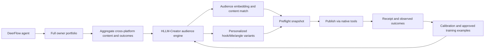

# HLLM-Creator integration

## Product decision

ByteDance HLLM-Creator is the audience intelligence foundation for the IP
Agent distribution. DeerFlow remains the only agent runtime. HLLM-Creator is
not a second agent and does not receive thread authority, platform credentials
or individual viewer identities.

The complete Apache-2.0 upstream source is pinned under
`third_party/bytedance/HLLM`. Product code must use a thin adapter or a separate
model-service process instead of copying the model implementation into
DeerFlow.

The delivery path has two explicit stages:

- **Now — HLLM-Lite:** Doubao performs semantic understanding and creative
  generation; a small audience sequence/ranking model learns from aggregate
  publishing outcomes.
- **Later — HLLM-Creator Cloud:** when dedicated GPU capacity is economical,
  deploy the full ByteDance architecture as our product cloud service and
  fine-tune it on approved Personal-IP examples.

Both stages implement `personal-ip-audience-preflight-v1`; upgrading the model
does not change DeerFlow, account coordination or evidence receipts.

## Boundary of responsibility

| Capability | Owner |
|---|---|
| Audience sequence encoding, dense audience representation, content-audience matching and personalized creative generation | HLLM-Creator |
| Creator expression constraints and interpretable audience projections such as Maslow/Jung/existence lenses | Thin product adapter; hypotheses remain revisable |
| Agent planning, tools, memory, browser, MCP, Skills and cross-account coordination | Native DeerFlow |
| Preflight freeze, publish receipt, observed metrics, retrospective calibration and approved-example promotion | Thin product evidence ledger |
| Image, video, speech and media finishing | Volcengine models and MediaKit |

HLLM-Creator's public example is personalized book-title generation. It is not
a CRM, publishing system, metrics collector or video pipeline. Those are
connected by DeerFlow, not reimplemented inside HLLM.

## Data adaptation

The upstream training row contract is preserved:

`user_profile`, `original_title`, `original_description`, `prompt1`,
`prompt2`, `response`, `title_list`, `item_id_list`.

`deerflow.personal_ip.hllm_creator.HLLMCreatorAdapter` produces this contract
from a chronological sequence of published content and aggregate metrics. The
adapter declares the result as an `aggregate_account_cohort`; it must never
claim that platform aggregates are person-level click histories. Raw viewer
ids, handles, contact details and raw comments are rejected at this boundary.

An account id may identify the target of a concrete data fetch or publish
receipt. It never binds a conversation or narrows the agent's portfolio.

## Runtime and packaging

The model environment stays separate from DeerFlow's backend environment.
Upstream HLLM depends on PyTorch, DeepSpeed, FlashAttention, FAISS and multiple
large language models. Its published HLLM-Creator model directory is 75.8 GB,
and the upstream reproduction script documents 64 A100 GPUs for the 1B + 8B
training run. Installing these dependencies into the Gateway would make the
ordinary customer package fragile without making DeerFlow more capable.

The customer source distribution therefore contains all model source and the
adapter, while weights are an explicitly selected model asset. Local inference
is offered only when compatible GPU capacity is detected; otherwise DeerFlow
calls a separately deployed HLLM provider. This is still one product and one
agent—only the heavy numerical runtime is isolated.

`deerflow.personal_ip.audience_provider` owns the stable service boundary. It
sends only the model-ready aggregate example, requires HTTPS for non-local
providers, attaches a deterministic idempotency digest, validates match scores
and rejects a response whose receipt digest does not match the request. Local
owner, subject and account ids never leave DeerFlow through this contract.

The first service implementation is `app.audience_lite`. Run it locally with
`make hllm-lite`; it uses the existing `VOLCENGINE_API_KEY`, Ark base URL and
`PERSONAL_IP_AUDIENCE_MODEL`. It returns multiple structured creative variants
through the shared receipt. HLLM-Lite v0 intentionally returns no
`match_score`: a score becomes available only after the small ranking model is
trained and evaluated against observed publishing outcomes.

## Minimal patch policy

Keep upstream model architecture and loss functions unchanged. Product work is
limited to:

1. the aggregate Personal-IP dataset adapter (implemented);
2. a structured batch/inference service contract instead of research CLI
   scripts (client contract implemented; model server pending);
3. explicit device and resource detection instead of hard-coded `cuda:0`;
4. optional parameter-efficient fine-tuning for a shared Personal-IP model;
5. dataset, checkpoint and evaluation version receipts.

Do not train a separate HLLM for every creator. A shared model learns across
approved, anonymized examples; each creator/account/cohort obtains its own
history-derived embedding. Full end-to-end training is a central model-building
operation, not a first-run customer requirement.

## Upstream provenance

- Source: <https://github.com/bytedance/HLLM>
- Paper: <https://arxiv.org/abs/2508.18118>
- Pinned commit: `864f17221c04a2d3082d9a072df00616bc7e6dab`
- License: Apache-2.0 (base TinyLlama/Qwen weights retain their own terms)
