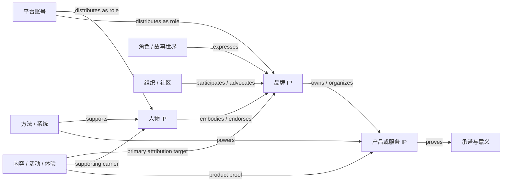
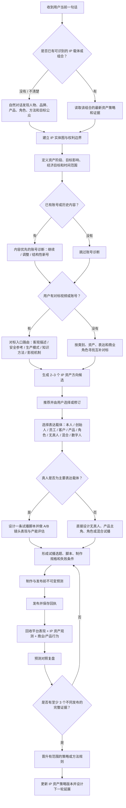

# IP Agent：从“个人创作者”到“影响力资产系统”的第一性原理研究

审计日期：2026-07-30

配套台账：
[IP_AGENT_SKILL_CAPABILITY_BOUNDARY_LEDGER.md](IP_AGENT_SKILL_CAPABILITY_BOUNDARY_LEDGER.md)

延伸研究：
[IP_AGENT_DIFFERENTIATED_IP_MOAT_RESEARCH.md](IP_AGENT_DIFFERENTIATED_IP_MOAT_RESEARCH.md)

## 2026-07-30 实施状态

本报告是审计时点的差距快照。其第一条纵切面现已进入源码：

- 人、品牌、产品和组织已成为正式经营主体，真实 Gateway E2E 已创建并回读产品主体；
- 策略 v4 不再用“变现优先 / 影响力优先”驱动决策，而是分别保存影响力、行为、经济
  目标、时间范围、优先级、护栏和明确不优化项；
- 不可变差异化命题、创意编码和七类资产结果观察已接入策略、预演、工作台和账号诊断；
- 账号诊断 v2 只有在影响力、行为、经济三类结果都完整测量且失败时，才允许使用
  “自娱自乐”分类；品牌认知或产品采用成功可以独立证明内容正在经营资产；
- 候选命题只有获得至少三条完整且支持命题、跨两类并包含下游行动的观察才能标为已验证；
  反证、混合与不确定观察不能推动状态。

仍未完成的是角色、方法、社区等更多实体类型、主体关系图、历史 mode 列物理迁移，以及
真实人物/品牌/产品三条纵向市场验收。下文“当前系统”均应按原审计时点理解。

## 结论摘要

当前系统不是“只有前端”，也不是“没有能力”。相反，它已经形成了很强的下游能力：

- 76 个已激活 Skill；
- 35 个电影化 IP Skill；
- 8 个平台账号诊断 Skill；
- 18 个生成媒体工艺与成片工作流 Skill；
- 53 个 `personal_ip_*` 原生工具；
- 主体、账号、策略、发布前预测、发布回执、指标、复盘、证据晋升和视频制作台账；
- 八平台浏览器登录、采集和发布框架；
- 两条视频生产模式与追加式证据链。

真正的结构性问题在顶层：

1. 产品口径说“IP”，核心策略却仍写死为“个人创作者”。
2. 数据层部分接受 `brand` 和 `organization`，策略工具新建主体时却固定写入
   `subject_type="creator"`、`relationship="self"`。
3. 当前策略只有 `person_model`，没有品牌模型、产品模型、角色模型、方法模型和主体关系图。
4. 当前把 `monetization_first` 与 `influence_first` 设为二选一模式，但影响力不是一种
   可选经营模式，而是 IP 成为资产的共同机制；变现只是影响力产生的一类行为和经济结果。
5. 电影化叙事、视觉、表演、生成、剪辑能力很强，但大部分处于“表达和生产层”，不能替代
   “这个 IP 是谁、由什么载体承载、要在谁心里形成什么意义、影响什么行为”的资产战略。
6. 当前指标闭环主要观测平台表现和商业转化，尚未观测 IP 是否被正确记住、正确归因、
   形成何种稳定联想、信任、偏好、推荐和延展接受度。

因此，下一版不能只在原有“个人 IP 孵化”流程里补两个品牌、产品字段。它需要把产品域从
`Personal-IP` 提升为一个多载体的 **IP influence asset portfolio**，再把人物、品牌、产品、
角色、方法、组织和社区作为不同的资产载体与表达角色。

## 一、先澄清这里的“IP”

法律语境中的 intellectual property 指受专利、版权、商标等制度保护的心智创造成果。
[WIPO 的定义](https://www.wipo.int/about-ip/en/)明确包含发明、作品、设计以及商业中的
名称、符号和图像。

本产品所说的“IP”更接近中文内容、品牌和商业语境中的“可持续影响力资产”，但不能与法律
权利混为一谈。WIPO 也将品牌、软件、数据、组织能力等放在更广的无形资产框架中，指出品牌
识别能够传递质量和可靠性并产生长期经济价值
([WIPO：Intangible Assets and IP](https://www.wipo.int/en/web/intangible-assets))。

品牌研究提供了更直接的资产依据：

- [AMA](https://www.ama.org/the-definition-of-marketing-what-is-marketing/)把品牌定义为
  能识别并区分一个卖方商品或服务的名称、符号、设计或其他特征，并援引 ISO 将品牌视为
  在利益相关者心中形成独特形象与联想的无形资产。
- [ISO 20671-1:2021](https://www.iso.org/standard/81739.html)要求从输入、输出和指标构成的
  综合框架评估品牌，而不只计算一次广告曝光或短期收入。
- WIPO 的经济研究把品牌描述为依赖消费者联想、能够累积关于企业和产品的信息存量、
  并持续产生收益的生产性资产
  ([Brands as Productive Assets](https://www.wipo.int/publications/en/details.jsp?id=3957&plang=EN))。
- 消费者会与品牌形成有强弱差异的关系，关系质量本身可以被诊断
  ([Fournier, 1998](https://academic.oup.com/jcr/article-abstract/24/4/343/1797962?login=false))；
  品牌还可能形成超越地理边界的社会关系和共同体
  ([Muñiz & O'Guinn, 2001](https://scholars.depaul.edu/en/publications/brand-community))。
- 人物影响力能够把文化意义转移给产品，但这说明人物和产品是可组合的不同载体，
  不是说产品必须依附人物才有 IP
  ([McCracken, 1989](https://ideas.repec.org/a/oup/jconrs/v16y1989i3p310-21.html))。

基于这些研究，本报告把产品定义为：

> **IP 是一个能够被特定公众正确归因，并通过持续接触积累稳定意义、关系和行为影响，
> 同时可被其权利人控制、复用与延展的无形影响力资产。**

这是产品设计定义，不代替商标、版权、专利或品牌估值的法律与财务意见。

## 二、影响力是共同机制，但“有影响”还不等于 IP

### 2.1 六个不可缺失的资产条件

本系统不应把 IP 压缩成单一分数。至少要同时保存六类可审计判断：

| 资产条件 | 必须回答的问题 | 反例 |
| --- | --- | --- |
| 识别与归因 | 公众能否认出并把内容、体验或承诺归到正确主体？ | 视频很火，但没人记得是谁、什么品牌 |
| 稳定意义 | 公众能否相对稳定地说出它代表什么、解决什么、坚持什么？ | 每条内容都不同，只有热闹没有联想积累 |
| 关系强度 | 是否形成信任、亲近、偏好、期待、身份认同或共同体？ | 知名但不信任，围观但不愿再次选择 |
| 持续表达 | 主体能否在真实能力、素材、产品和成本约束下重复兑现？ | 一次性噱头，后续只能重复或造假 |
| 行为影响 | 是否改变记忆、关注、搜索、询问、试用、购买、复购、推荐或参与？ | 互动很高，但目标行为没有变化 |
| 权属与延展 | 名称、形象、内容、数据、角色和方法是否可控制、保护、授权、复用和扩展？ | 依赖不可控平台、侵权素材或他人身份 |

六项之间不是一条“爆款公式”。它们是一组约束：

- 未归因的流量不会完整沉淀到目标资产；
- 被记住但意义错误，可能积累的是声誉负债；
- 有转化也未必形成 IP，例如一次折扣或精准投放可以卖货，但不一定增加长期偏好；
- 有粉丝也未必形成可调用资产，若离开某个平台、某个热点或某个创作者就失效；
- 有版权不等于有影响力，有影响力也不自动等于权利清晰。

### 2.2 载体不是只有“人”

目标系统至少支持以下 IP 载体：

| 载体 | 影响力主要沉淀在哪里 | 典型证据 |
| --- | --- | --- |
| 人物 | 名字、脸、声音、经历、能力、价值观和关系 | 被正确识别、信任、邀约、跟随、购买其推荐或服务 |
| 品牌 | 名称、符号、承诺、声誉、独特资产和体验一致性 | 正确品牌联想、偏好、溢价、搜索、推荐、跨品类接受 |
| 产品或服务 | 产品名、外形、交互、使用仪式、功效证明和口碑 | 试用、采用、复购、留存、产品名搜索、演示复述 |
| 角色或故事世界 | 角色身份、关系、世界规则、情绪承诺和可续写性 | 追更、二创、角色识别、衍生品或跨媒介接受 |
| 方法或系统 | 方法名、问题框架、步骤、证据和可复制结果 | 被引用、教学、采用、认证、授权和迁移 |
| 组织或社区 | 共同使命、规范、成员关系、仪式和集体行动 | 加入、参与、留存、贡献、成员推荐和外部声誉 |

一个经营组合通常包含多个载体。例如：

- 创始人体现品牌，但品牌不等于创始人；
- 产品证明品牌承诺，但产品也可以成为最强识别载体；
- 客户和员工可以作为证据或表达角色，但不自动拥有主体权利；
- 虚构角色可以服务品牌，也可以成为可独立延展的资产；
- 平台账号是分发和操作资源，不是人物、品牌或产品本身。

## 三、当前 76 个 Skill 的真实结构

仓库当前有 95 个公共 Skill 包，IP Agent 配置激活 76 个。其余 19 个是通用研究、开发、
部署、审查或内容工具，并未进入客户 IP Agent 的自动路由。激活的 76 个分布如下：

| 能力组 | 数量 | 主要作用 |
| --- | ---: | --- |
| 产品总控 | 1 | 读取原生状态、编排经营和视频闭环 |
| 八平台账号诊断 | 8 | 平台约束、内容与漏斗诊断、继续/调整/新号判断 |
| 电影化 IP 矩阵 | 35 | 研究、叙事、人物、类型、情绪、剧本、导演、工种和校准 |
| 策略与视频学习 | 4 | 个人策略、内容校准、视频模式学习、长视频方法蒸馏 |
| 通用研究与生成 | 5 | 深度研究、火山能力路由、图像、视频、播客生成 |
| MediaKit 执行 | 5 | 音视频、图像、音频的命令级执行 |
| 生成媒体专业工种 | 14 | 参考、客观描述、镜头、美术、灯光、表演、声音、字幕、调色等 |
| 成片工作流 | 4 | 品牌发布片、产品广告、UGC 广告、长口播/播客切条 |
| 合计 | 76 |  |

这里有两个重要校正：

1. “35 个电影引擎”不是准确说法。35 个 Skill 的正式结构是：
   1 个总控、4 个操作系统、9 个基础模块、11 个工种实验室和 10 个类型编剧室。
2. 76 个 Skill 中绝大多数在解决“怎么表达、怎么拍、怎么生成、怎么剪、怎么发布”，
   不是在解决“哪个载体要积累什么影响力资产”。

完整逐项边界见配套能力台账。

## 四、当前系统已经做对的部分

### 4.1 产品状态不是只存在于聊天或前端

后端已经有 owner-scoped repository、迁移、路由和原生工具，覆盖：

- 主体和八平台账号；
- 不可变策略版本；
- 账号诊断上下文与编译器；
- 发布前盲预测；
- 追加式发布回执；
- 平台观察和指标；
- 复盘与三次不同发布门槛的证据晋升；
- 九阶段视频制作事件账本；
- 本地素材检查、生成镜头 QA、插帧、Remotion/HyperFrames 和最终交付。

因此问题不是“底座没动，全部堆在前端”。问题是：

> 底座已经能保存和执行很多事情，但它保存的顶层真相仍是“个人创作者商业孵化”，
> 还不是多载体 IP 资产组合。

### 4.2 已建立了正确的证据纪律

当前系统已经具备值得保留的原则：

- 新用户先回应当前请求，不扫描一排空台账；
- 内容优先，平台是约束和放大器；
- 低播放量不能单独证明账号已死；
- 账号换新必须有结构性平台证据；
- 神经科学名词不能代替可观察机制；
- 不承诺“必爆”；
- 发布前预测不可回写；
- 缺失指标保持缺失；
- 至少三条不同发布的完整复盘后才晋升规则；
- Skill 是知识和工作流，权威状态、权限、幂等和证据必须由后端契约负责。

这些原则可以直接上移为通用 IP 系统的证据基础。

### 4.3 表达与生产能力已经很深

35 个电影化 Skill 与 18 个生成媒体 Skill 合起来，已经能覆盖：

- 真实材料与影视研究；
- 欲望—行为、主题、人物、关系、类型、情绪和长期圣经；
- 单集、场景、对白、调度、摄影、光色、美术、声音、表演和剪辑；
- 参考素材的权利边界与非模仿转译；
- 品牌视觉系统、产品展示、角色连续性和生成镜头规格；
- 品牌发布片、产品广告、UGC 广告和播客切条；
- 两类视频生产、候选、QA、组装、修订和交付。

问题不在“能力不够多”，而在缺少顶层路由和资产真相，导致强能力可能在错误的主体、
错误的目标和错误的阶段上被调用。

## 五、十二个结构性缺口

### F1：主体模型与产品口径冲突

已存在的 `PersonalIPSubjectRow` 注释允许人物、品牌或组织，Gateway/UI 也允许
`creator | brand | organization`。但：

- `personal_ip_record_strategy` 在首次创建主体时写死 `creator/self`；
- API 和 UI 没有 `product`、`service`、`character`、`method`、`community`；
- 一个账号只有一个 `subject_id`；
- 没有主体间关系表。

结果是系统无法表达“创始人体现品牌、品牌拥有产品、产品证明承诺、角色服务品牌”。

### F2：“变现优先 / 影响力优先”是错误的顶层二分

当前数据库约束、策略方法、账号诊断和 Skill 都依赖：

```text
monetization_first | influence_first
```

正确模型应拆成相互独立的轴：

| 轴 | 例子 |
| --- | --- |
| 资产阶段 | 新建、增长、重定位、修复、延展 |
| 目标公众 | 买家、用户、合作方、员工、投资人、社区成员 |
| 目标影响 | 记住、正确归因、理解、信任、偏好、关注、采用、推荐、参与 |
| 经济目标 | 询盘、试用、购买、收入、复购、留存、溢价、授权、生态扩张 |
| 时间范围 | 本轮试验、季度、年度、长期 |
| 优先顺序 | 主目标、护栏目标、暂不优化目标 |

影响力是共同资产机制；经济目标是否优先、何时兑现，是战略选择。

### F3：没有 IP 资产组合图

当前“主体—账号”是一对多树形关系，不足以表达真实 IP 组合。需要：

- `ip_entities`
- `ip_entity_relations`
- `ip_account_entity_roles`

每条关系要有类型、方向、证据、权利和有效期。账号在一次行动中仍然只是操作目标，
而一次内容或活动要明确“主要归因目标”和“辅助表达角色”。

### F4：策略契约只有 `person_model`

当前 `personal-ip-strategy-v2` 强制要求年龄语境、性别语境、职业、所在地、个人历史、
专业证据、照片状态和声音状态。这对人物 IP 可以成立，但对一个产品、品牌、角色或方法
会产生荒谬输入。

需要一个通用策略外壳和按载体区分的证据模型：

- 人物：经历、能力、价值边界、公开呈现、产能与同意；
- 品牌：来源、类别、承诺、声誉、差异化资产、品牌架构、风险与延展；
- 产品：用户任务、问题、功能/体验证据、演示、采用阻力、使用仪式、生命周期；
- 角色：身份锁、世界规则、关系、故事生成器、权利与衍生边界；
- 方法：问题、步骤、适用条件、反例、证据、迁移和认证边界；
- 组织/社区：使命、成员、规范、仪式、参与和治理。

### F5：35 个电影化 Skill 的长期创作状态没有一等公民契约

电影化总控定义了 `bible_version`、`lifecycle_desire_hash`、类型、情绪、视觉语法和
连续性等共享状态，但后端没有相应的版本化 creative bible repository/read model。
目前这些结果主要存在于 Skill 输出、聊天或外部产物，再通过少量策略字段和证据引用间接关联。

这与“聊天不是生产真相”的产品原则不一致。至少需要：

- `ip-creative-bible-v1`
- `ip-expression-system-v1`
- `ip-content-pilot-v1`
- 对应的不可变版本、证据引用和当前采用版本。

不应给 35 个 Skill 各建一张表；应把它们编译成少数稳定的产品契约。

### F6：平台与商业指标不能完整证明 IP 资产增长

当前可观测项主要是播放、互动、账号数据、意向和转化。还缺：

- 无提示/有提示识别；
- 正确主体归因；
- 核心意义和承诺复述；
- 独特资产识别及混淆率；
- 信任、偏好和再次选择；
- 品牌名/产品名搜索；
- 采用、留存、复购；
- 推荐、二创和社区参与；
- 新产品、新品类、角色或方法的延展接受度。

这些指标不都能从八个平台后台自动取得。系统需要支持平台观察、问卷/访谈、CRM、销售、
产品分析和人工证据的统一来源与覆盖说明。

### F7：没有正式的表达载体路由和真人镜头表现评估

当前 `coach-ip-screen-performance` 能把剧本转成可执行表演任务，但没有：

- A/B 试拍输入契约；
- 表现力和产能的不可变评估回执；
- 对指令响应、镜头稳定、声音清晰、情绪范围、真实感、连续性和制作成本的观察；
- 人物口播、访谈纪录、客户证言、员工出镜、产品主角、无真人、混合、角色或数字人的
  正式路由结论。

真人表现评估只应在“真人是主要表达载体”时运行。数字人也不应被简单降格为“怕镜头的
替代品”；它可以是有权利、同意和一致性约束的品牌角色策略。

### F8：对标视频的五种读取方式缺少统一入口

现有能力各自合理，但入口容易混淆：

| 现有 Skill | 唯一职责 |
| --- | --- |
| `precise-video-description` | 只记录时间顺序、主体、场景、运动、空间和摄影等客观可见事实 |
| `reference-media-analysis` | 做权利、来源、非模仿转译、风险和生产交接 |
| `video-pattern-learning` | 从视频提取脚本、镜头、剪辑、字幕、声音和平台生产语法 |
| `video-method-distillation` | 从课程、访谈、播客等长视频提取方法、规则和检查表 |
| `distill-screen-methods` | 跨影片、主创、课程和资料综合影视机制卡 |

缺的是一个 `benchmark intake router`：先判断用户要学习“客观事实、生产模式、知识方法、
影视机制还是安全参考”，再调用对应能力。

### F9：多个专业 Skill 处在同一语义空间

应按四层重新定义边界：

1. 决策层：为什么这样表达，要形成什么意义和行为；
2. 规格层：把已批准意图变成镜头、灯光、表演、声音等可执行规格；
3. 执行层：调用生成、渲染、MediaKit、浏览器和发布；
4. 证据层：保存版本、权利、QA、预测、观察、复盘和晋升。

当前高风险碰撞包括：

- `direct-ip-visual-language` / `design-cinematography` /
  `cinematic-shot-direction`
- `design-light-color-texture` / `visual-style-direction` /
  `lighting-direction` / `color-grading-finishing`
- `design-production-world` / `production-design-direction`
- `coach-ip-screen-performance` / `performance-direction`
- `design-screen-sound` / `dialogue-editing-adr` /
  `sound-design-foley` / `music-supervision-scoring`
- `edit-screen-rhythm` / `byted-mediakit-editing`
- `audit-ip-continuity` / `character-design-continuity` /
  `asset-continuity-management` / generated-shot QA

这些不一定要合并，但必须在 description、输入契约和交接字段上明确上下游。

### F10：Skill 包完整度不等于行为已验证

本轮静态审计结果：

- 76 个激活 Skill 中 45 个有 `agents/openai.yaml`；
- 18 个上游生成媒体 Skill 有 `EVAL.md`；
- 47 个包含 `references/`；
- 10 个包含 `scripts/`；
- `visual-style-direction/SKILL.md` 为 745 行，超过当前 Skill 创建规范建议的
  500 行上下文上限，应做渐进披露；
- 5 个 MediaKit Skill 的 frontmatter 含不被当前验证器接受的 `version` 字段，
  因而 71/76 通过 `quick_validate.py`，5/76 失败；
- 当前仓库测试证明包存在、矩阵数量、资源哈希和部分工具边界，但没有一套覆盖 76 个 Skill
  的正触发、负触发、兄弟混淆、行为结果和回归留存报告。

因此当前保证级别主要是 `static_only`，不能把“配置了 Skill”表述成“普通用户路径已验证”。

### F11：真实验收仍集中在底座和局部路径

现有产品台账显示：

- 后端原生基础约 97%；
- 按当前窄口径计算的加权产品完成度约 78%；
- 只有抖音真实指标路径较完整，其余七平台仍需真实账号矩阵验收；
- 自然对话孵化、三条发布后的完整学习闭环仍未真实验收；
- 完整多镜头生成片与真实素材片仍有开放门槛；
- 电影化矩阵尚未在一个真实主体上跑完证据—创作—拍摄—发布—复盘；
- Skill Lab 已隔离，但还没有首个私有探针集和候选—回归—晋升—回滚验收。

### F12：当前 78% 不能沿用到扩大后的“通用 IP 系统”

`IP_AGENT_PRODUCT_LEDGER.md` 的 78% 是对当前“个人证据—商业模型—个人定位—平台内容”
范围的计算。品牌、产品、角色、方法、社区、IP 组合关系和 IP 资产指标加入正式范围后，
必须重算权重和完成度，不能拿旧分数覆盖新缺口。

## 六、目标产品域：IP 资产组合，而不是一堆账号

### 6.1 实体图

建议的数据模型：



实体建议字段：

- `entity_type`
- `canonical_name`
- `owner_user_id`
- `ownership_status`
- `rights_refs`
- `public_identity_assets`
- `status`
- `created_at`

关系建议字段：

- `from_entity_id`
- `relation_type`
- `to_entity_id`
- `evidence_refs`
- `rights_scope`
- `valid_from`
- `valid_to`

账号关系不能再只是一列 `subject_id`。需要表达账号在一次内容、活动或经营目标中是：

- primary attribution target
- spokesperson
- endorsement carrier
- proof source
- distribution channel
- community host

### 6.2 通用策略快照

建议以 `ip-asset-strategy-v1` 代替仅面向人的策略外壳：

```yaml
entity_portfolio:
  primary_entity_id:
  supporting_entity_ids: []
  relation_refs: []
asset_intent:
  stage:
  target_publics: []
  target_influence_behaviors: []
  economic_outcomes: []
  priority_order: []
  horizon:
meaning_system:
  category_frame:
  promise:
  associations_to_build: []
  associations_to_avoid: []
  proof_system: []
relationship_system:
  desired_relationship:
  trust_basis: []
  participation_path: []
expression_system:
  primary_carrier:
  formats: []
  distinctive_assets: []
  production_constraints: []
rights_and_extension:
  ownership_refs: []
  protected_assets: []
  consent_limits: []
  extension_hypotheses: []
subtype_profile:
  contract_version:
  payload: {}
benchmarks:
  evidence_refs: []
  complementary_roles: []
pilots:
  hypotheses: []
validation:
  evidence_refs: []
```

其中 `subtype_profile` 根据人物、品牌、产品、角色、方法或社区使用不同的服务端验证器。
不能让任意 JSON 自称为合法策略类型。

### 6.3 IP 资产观测

建议新增 `ip-equity-observation-v1`，每条观测必须包含：

- 被观测实体；
- 目标公众；
- 指标维度；
- 来源；
- 观察时间和窗口；
- 样本、覆盖、缺失和偏差；
- 原始证据引用；
- 是否可与基线比较；
- 是否来自平台、CRM、产品分析、访谈、问卷或人工编码。

观测维度：

```text
recognition
correct_attribution
meaning_association
trust
preference
return_intent
search_or_inquiry
trial_or_adoption
purchase_or_revenue
retention_or_repeat
recommendation_or_advocacy
community_participation
extension_acceptance
```

平台播放和互动仍然保留，但只作为其中一部分证据。

## 七、Skill、后端契约和 UI 的职责边界

### 7.1 Skill 应负责

- 根据自然语言判断当前问题属于哪一类；
- 运用研究、策略、叙事、导演和制作知识；
- 形成候选方案、权衡和可证伪假设；
- 把输出交给原生编译器；
- 根据证据选择下一步。

### 7.2 后端必须负责

- 用户、主体、账号和资产关系的权限；
- 数据类型、状态迁移和字段验证；
- 幂等、追加式版本和不可变证据；
- 权利、同意、凭证和隐私边界；
- 账号和发布目标的服务端绑定；
- 预测、发布、指标、复盘和晋升的证据连接；
- 付费、预算、合规和高风险动作批准；
- 不能由聊天重建的业务真相。

### 7.3 UI 应负责

- 呈现用户能理解的里程碑，而不是 Skill 名和内部 stage；
- 展示当前采用的 IP 载体组合、方向候选、表达方案和试验；
- 承载选择、同意、账号登录、A/B 试拍、视频审片和发布批准；
- 显示证据覆盖和“不知道”，不伪造完整度；
- 让品牌、产品和人物都能成为经营对象；
- 不把普通用户变成填写内部 JSON 契约的操作员。

## 八、目标工作流



### 第一次对话的专业度从哪里来

第一次对话不是把所有模块都跑一遍，而是：

1. 承接用户当前目标；
2. 判断当前说的是人物、品牌、产品还是一个组合；
3. 只问一个会改变载体、公众、目标影响或权利边界的问题；
4. 给出一个可见的专业判断和下一步证据需求；
5. 不扫描空的发布、指标、复盘和视频台账。

专业度来自“迅速抓住资产问题”，不是来自展示内部流程长度。

## 九、现有 Skill 的重新编排

建议固定四层路由：

### 9.1 决策与意图层

负责：

- IP 组合与载体；
- 资产阶段、公众、意义、关系和行为目标；
- 账号诊断；
- 对标研究；
- 主题、人物、类型、情绪和内容战略；
- 表达载体选择。

此层输出必须先被用户采用或进入版本化候选，才能下沉。

### 9.2 生产规格层

负责：

- 视觉系统；
- 镜头、灯光、美术、表演、声音、字幕和调色；
- 角色与资产连续性；
- 具体视频计划、分镜、素材、旁白和时间线。

此层不能擅自改写 IP 的目标公众、核心意义或产品事实。

### 9.3 执行层

负责：

- 图像、视频、播客生成；
- MediaKit、FFmpeg、HyperFrames、Remotion；
- 浏览器采集和发布；
- 平台适配。

此层不能以“工具能做”为理由越权改变策略。

### 9.4 证据与学习层

负责：

- 权利和同意；
- 版本、哈希和 QA；
- 盲预测、发布回执、指标和 IP 资产观测；
- 复盘、规则晋升、Skill 审查和回滚。

该层是系统可信度的来源，不能被 Skill 文本替代。

## 十、需要新增、重构和避免新增的 Skill

### 10.1 P0：需要新增或重构

| 建议 | 形式 | 原因 |
| --- | --- | --- |
| `architect-ip-portfolio` | 新 Skill + 原生实体图编译器 | 发现和设计人物、品牌、产品等载体及关系 |
| `ip-strategy-director` | 重构为通用 IP 资产策略总控 | 去掉个人模型和二元 mode 的顶层垄断 |
| `design-person-ip` | 可作为 subtype Skill 或引用包 | 保留现有个人证据、能力、公开呈现与产能知识 |
| `design-brand-ip` | 新 subtype Skill 或引用包 | 品牌承诺、声誉、独特资产、架构和延展 |
| `design-product-ip` | 新 subtype Skill 或引用包 | 产品任务、证明、使用仪式、采用、留存和口碑 |
| `route-ip-expression` | 新 Skill + 表达路由契约 | 决定谁出镜、产品是否主角、是否无真人/混合/数字人 |
| `assess-screen-presence` | 新 Skill + A/B 评估回执 | 只评估真人镜头表现与可训练性，不诊断人格 |
| `diagnose-ip-equity` | 新 Skill 或扩展校准 Skill | 判断增长的是流量、销售还是可归因的 IP 资产 |
| `benchmark-intake-router` | 可并入总控，不一定独立安装 | 解决五类视频/资料读取的兄弟混淆 |

是否把人物、品牌、产品拆成三个独立 Skill，应先用触发测试决定。若一个通用 Skill 加
三份渐进披露引用可以稳定路由，就不要为了名称对称制造 Skill 膨胀。

### 10.2 P1：需要收窄 description 和交接契约

- `personal-ip-operator`：升级为 IP 组合经营总控，不再称只经营 creator/personal-IP。
- `build-cinematic-ip-system`：明确是“叙事化表达子系统”，不是整个 IP 战略总控。
- `direct-ip-visual-language`：只做导演意图和整体视听语法。
- `design-cinematography`：优先做真人/实拍的叙事摄影和现场覆盖。
- `cinematic-shot-direction`：优先做生成或混合媒体的精确镜头规格与可剪连续性。
- `coach-ip-screen-performance`：只做真人、素人、演员的可演任务。
- `performance-direction`：只做合成表演者、头像、动画角色和 AI 声音。
- `design-production-world`：做叙事意义与世界规则。
- `production-design-direction`：做生成生产的布景、道具、材质和交接规格。
- `design-screen-sound`：做剧本阶段的声音叙事。
- ADR、Foley、音乐 Skill：做各自后期执行规格。
- `edit-screen-rhythm`：做叙事和观众心理的剪辑选择。
- MediaKit editing：只执行明确的机械剪辑操作。
- 8 个平台诊断 Skill：保留平台一手规则和特殊证据，公共内容/漏斗协议收回一个共享引用，
  避免八份文本漂移。

### 10.3 不应新增成 Skill 的东西

以下必须是后端契约或服务：

- 主体类型、关系和账号角色；
- 策略状态迁移；
- 目标影响和经济目标枚举；
- 权利、同意和凭证隔离；
- A/B 试拍和 IP 资产观测的不可变回执；
- 预算、合规和高风险批准；
- 发布、指标、复盘和晋升阈值；
- 当前采用版本和回滚。

把这些写进 Skill 文本，只会得到一套无法强制、无法审计的“提示词规则”。

## 十一、优先级与实施顺序

### P0-A：先改产品真相，不先扩写更多拍摄 Skill

1. 新增 IP entity graph 和账号—实体角色关系。
2. 设计 `ip-asset-strategy-v1` 与 subtype contracts。
3. 用独立目标轴替换 `monetization_first | influence_first`。
4. 迁移旧 creator 策略为 person subtype，保持旧版本可读。
5. 重构原生 strategy record/read 工具，不再自动写死 creator/self。

### P0-B：补影响力资产的观测和诊断

1. 新增 `ip-equity-observation-v1`。
2. 把平台、CRM、销售、产品分析、访谈和人工证据统一到带覆盖的来源模型。
3. 重写“自娱自乐”判定：
   - 只有明确商业目标；
   - 至少三条不同发布；
   - 意向和转化覆盖完整；
   - 观察窗口有效；
   - 失败才可作内部经营分类；
   - 对品牌认知、产品采用、公共影响等目标使用“目标未被验证/未达成”，不滥用该标签。

### P0-C：补表达路由与表现评估

1. 建立表达载体候选；
2. 真人主导时生成一条选题和脚本；
3. 接收 A/B 试拍；
4. 保存可观察评估；
5. 给出本人直出、训练后本人、访谈纪录、客户/员工、产品主角、无真人、混合或数字人结论；
6. 将结论写入策略采用版本。

### P1-A：固化电影化创作真相

把 35 个 Skill 输出编译成少数版本化契约，而不是继续把共享状态留在聊天：

- creative bible
- expression system
- pilot portfolio
- episode package
- continuity audit

### P1-B：治理 Skill 边界

1. 修复 5 个 MediaKit frontmatter；
2. 将 `visual-style-direction` 主文缩到 500 行以内，其余移到 references；
3. 为高碰撞兄弟 Skill 增加正触发、负触发和交接条件；
4. 建立 76 个 Skill 的静态审查基线；
5. 对总控、策略、对标路由和专业碰撞组做行为与回归验证。

### P1-C：真实验收

至少建立以下真实案例：

1. 新人物 IP，无账号；
2. 有多个账号但内容弱、本人自我感觉良好的创作者；
3. 不依赖创始人出镜的品牌；
4. 一个产品本身作为主 IP 载体；
5. 创始人、品牌和产品同时存在且意义发生冲突；
6. 角色驱动品牌；
7. 真人试拍后转为无真人或混合表达；
8. 同一 IP 在两个平台传播表现不同但核心资产指标一致；
9. 流量增长但归因失败；
10. 销售增长但品牌资产未增长；
11. 三条发布后晋升规则；
12. 一条内容爆发但因样本不足拒绝永久固化。

每个案例都需要保留输入、路由、契约、用户选择、发布前预测、发布结果、资产观测和回归证据。

## 十二、验收标准

完成这次架构升级，至少要满足：

- 用户可以建立人物、品牌、产品、角色、方法和组织/社区实体；
- 可以表达实体之间的拥有、体现、背书、证明和延展关系；
- 首次策略不会要求产品填写年龄、性别、照片或个人经历；
- “影响力”不再是与变现二选一的 mode；
- 每个策略明确目标公众、目标影响、经济目标和时间范围；
- 账号诊断不会把品牌认知项目或产品采用项目误判为“自娱自乐”；
- 对标输入能够稳定路由到五类不同分析；
- 真人只有在承担主要表达角色时才进入表现评估；
- 品牌和产品可以选择不依赖真人的表达方案；
- 35 个电影化 Skill 的长期输出有版本化产品真相；
- 平台表现、商业结果和 IP 资产结果能被区分；
- 任何“IP 已验证”结论都能追溯到不可变证据；
- 76 个 Skill 的高风险路由有正例、反例、兄弟混淆和回归结果；
- 真实人物、真实品牌、真实产品三条路径至少各完成一次端到端验收。

## 最终判断

当前系统的技术底座、电影化能力和媒体执行能力已经相当丰富，但架构顺序倒置：

> **我们先拥有了一家很强的内容工作室、影视学院和媒体工厂，后来才发现它们上面缺少一个
> 真正的 IP 资产管理与决策系统。**

下一步的主要工作不是继续增加“怎么拍”的 Skill，而是建立多载体 IP 的实体图、目标模型、
策略契约、资产观测、表达路由和版本化创作真相。完成这层之后，现有 76 个 Skill 才会从
“能力集合”变成一个围绕影响力资产积累而工作的智能体系统。
