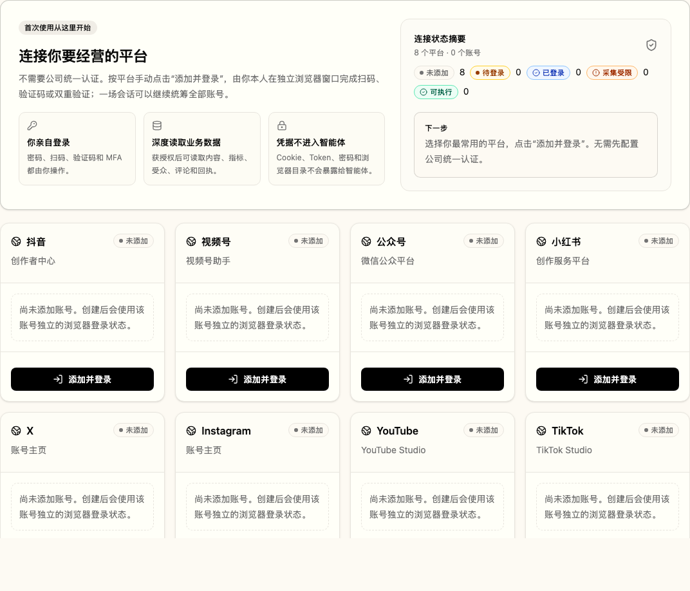
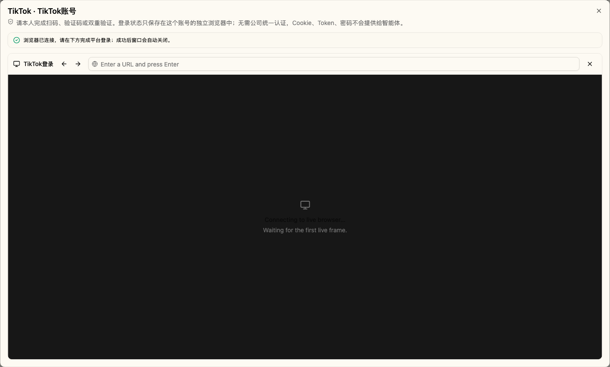

# Personal-IP customer onboarding UI handoff

This handoff records the implementation and verification for the independent
`parallel/onboarding-ui` work line. It intentionally does not change
`docs/IP_AGENT_PRODUCT_LEDGER.md`.

## Scope

- Eight browser-first platform cards remain visible before any account exists.
- Customer-facing connection states are explicit: 未添加, 待登录, 已登录,
  采集受限, 可执行.
- Customers initiate each login manually. Browser-first use does not require a
  company-wide authentication setup.
- The UI explains that authorized account/content/metric/audience/comment and
  receipt data may be read deeply, while Cookie, Token, password, and browser
  profile details never enter agent context.
- A portfolio summary, context-aware next step, account-level action, load
  recovery, login-stream retry, and successful-login auto-close are included.
- A successful login stores only non-secret status metadata on the existing
  account record. No real platform write operation is used in verification.

## Screenshots

### First-use overview (1440 × 900 desktop viewport)

### Account login dialog (responsive landscape browser surface)

## Verification

All verification used mocked Personal-IP APIs and a mocked account-scoped
WebSocket. No real platform login, collection, publication, deletion, or other
write operation was triggered.

| Check                          | Result                                           |
| ------------------------------ | ------------------------------------------------ |
| Next.js production build       | Passed                                           |
| ESLint (complete frontend)     | Passed                                           |
| TypeScript `tsc --noEmit`      | Passed                                           |
| Prettier (complete frontend)   | Passed                                           |
| Rstest unit suite              | 82 files, 697 tests passed                       |
| Playwright onboarding flow     | 1 test passed                                    |
| Playwright login browser ratio | Passed; rendered surface ratio > 1.5             |
| In-app browser, 1440 × 900     | First-use summary and desktop grid visible       |
| In-app browser, 1280 × 720     | No horizontal overflow; onboarding title visible |

The environment-provided `pnpm` wrapper attempted a dependency status install
and stopped at its unapproved-build policy before running `pnpm check`. No build
scripts were approved. The same locked local ESLint and TypeScript binaries were
run directly and both passed; `pnpm-workspace.yaml` was restored unchanged.

## Merge notes

- Source branch: `parallel/onboarding-ui`
- Baseline: `439f309`
- Merge the final handoff commit into the target integration branch.
- Frontend UI, frontend tests, screenshots, and this handoff are the only
  product areas changed; there are no backend or migration changes.
- `docs/IP_AGENT_PRODUCT_LEDGER.md` remains unchanged as requested.
